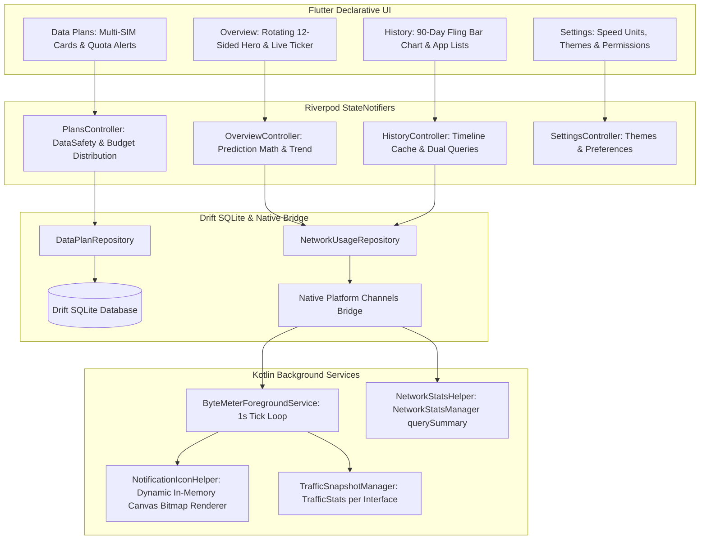

# ByteMeter ⚡

A modern, fast, and privacy-focused network bandwidth meter and mobile data usage tracker built with **Flutter** and **Native Android Kotlin**. Inspired by open-source tools like *Traffic Light* and *Internet Speed Meter*.

---

## 🌟 Key Features

- 🚀 **Real-Time Status Bar Speed Indicator**: Sub-second upload and download speeds rendered dynamically as numeric status bar icons.
- 🔋 **Zero Battery Drain on Screen Off**: Native broadcast receiver halts polling immediately when the display locks.
- 📊 **90-Day Historical Analytics**: Smooth fling-scrollable bar chart with spring snap physics and interactive date navigation.
- ⚖️ **Dual Query Comparison Engine**: Compare Wi-Fi vs. Mobile, Upload vs. Download, or App A vs. App B side-by-side.
- 📱 **Per-App Bandwidth Breakdown**: Ranked list of all data-consuming apps with real app icons, direct app launcher, and quick filters.
- 💳 **Multi-SIM Data Plan Tracking**: Track multiple carrier SIMs, daily/monthly rollover data, and extra addon packs.
- 🛡️ **Predictive & Safety Algorithms**: 4-week hour-ratio daily predictions, 7-day trend percentages, and data safety pacing alerts.
- 🚫 **Zero-Rated App Exclusions**: Exclude carrier-free apps (e.g. WhatsApp, YouTube, Spotify) from data quota calculations.
- 🎨 **Material You & AMOLED Dark Mode**: Dynamic wallpaper color extraction, AMOLED pitch black `#000000`, and frosted glass blur.

---

## 🏛️ Architecture Overview

ByteMeter follows the **MVVM (Model-View-ViewModel / Notifier)** Clean Architecture pattern:

---

## 📚 Complete Project Documentation

Comprehensive documentation is available in the [`docs/`](docs/) directory:

| Document | Description |
|---|---|
| 📖 [**Documentation Hub**](docs/README.md) | Navigation index and project overview. |
| 🏛️ [**MVVM & Clean Architecture**](docs/architecture-mvvm.md) | MVVM architecture, state flow, controller templates, and repository patterns. |
| 📋 [**Phase-by-Phase Execution Plan**](docs/phases.md) | 7-Phase implementation roadmap with interactive checkboxes (`- [ ]`). |
| 🌳 [**Complete Project Tree View**](docs/project-tree-view.md) | Exhaustive directory and file structure breakdown. |
| 📦 [**Dependencies & Packages**](docs/packages.md) | Package specifications, version constraints, and technical rationale. |
| 🎨 [**UI/UX Design System & Shaders**](docs/design.md) | Material You theming, typography, custom canvas shaders, and mathematical formulas. |
| 🛠️ [**Flutter Engineering Skills**](docs/flutter-skills.md) | CustomPainter algorithms, velocity fling physics, Drift SQLite streams, and platform channels. |
| 🔌 [**Dart & Flutter MCP Integration**](docs/dart-mcp-skills.md) | Model Context Protocol integration for Dart Analysis Server, DevTools, and Android CLI. |

---

## 🛠️ Tech Stack & Requirements

- **Flutter SDK**: `^3.13.0` (Channel stable, Dart 3.13.0)
- **Target OS**: Android 12+ (minSdk 28, targetSdk 37)
- **State Management**: `flutter_riverpod: ^2.6.1`
- **Database**: `drift: ^2.24.2` + `sqlite3_flutter_libs: ^0.5.28`
- **Settings**: `shared_preferences: ^2.3.5`
- **Design System**: Material Design 3 Expressive + `dynamic_color: ^1.7.0`
- **Native Android Layer**: Kotlin 2.4.0, AGP 9.1.0, JVM 17, `NetworkStatsManager`, `TrafficStats`, Keystore AES-GCM
