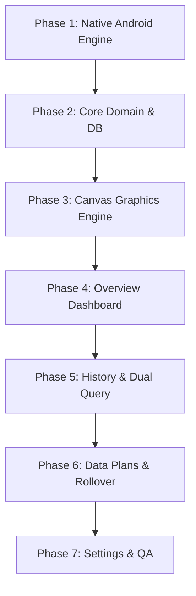
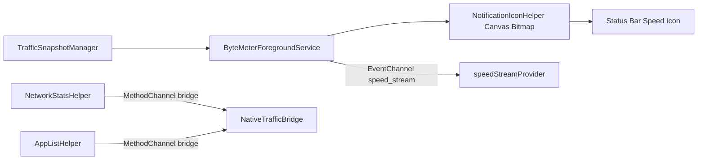
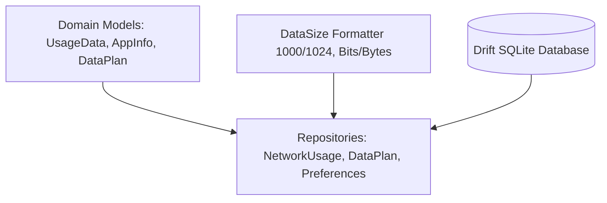
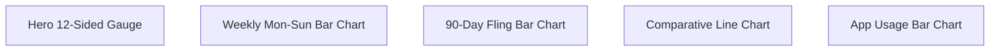
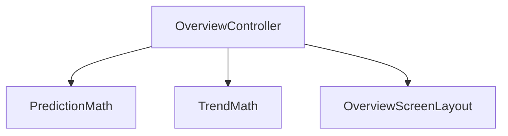
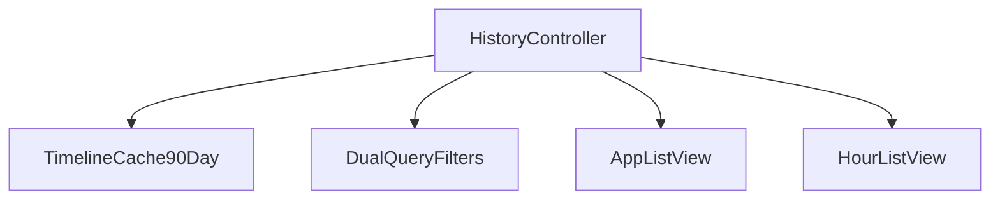
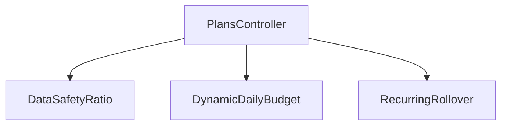
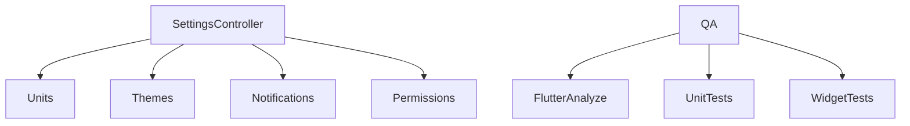

# ByteMeter: Detailed Phase-by-Phase Implementation Checklist

## Goal Description
Provide an actionable, granular task checklist with interactive markdown checkboxes (`- [ ]`) to track the complete step-by-step implementation of **ByteMeter** (Flutter rebuild of the Traffic Light network meter and data usage monitor).

---

## 🎯 Verification & Build Protocol

> [!IMPORTANT]
> - **Static Analysis Verification**: Run `flutter analyze` immediately upon completing each phase. A phase is ONLY considered complete when `flutter analyze` returns with **0 issues found**.
> - **Strictly No APK Builds**: NEVER run `flutter build apk` during execution to avoid long compilation times. Rely strictly on `flutter analyze` and fast unit/widget tests (`flutter test`).
> - **Graphify Visuals**: Every phase, architectural subsystem, and data flow is documented with Graphify / Mermaid diagrams.

---

## Master Architecture Flow



---

## Proposed Changes & Granular Checklists

### Phase 1: Native Android Background Engine & Platform Channels



- [x] **Task 1.1: Android Manifest & Permissions Configuration**
  - [x] Add `ACCESS_NETWORK_STATE`, `FOREGROUND_SERVICE`, `FOREGROUND_SERVICE_SPECIAL_USE` to [`AndroidManifest.xml`](file:///C:/Users/roni2/Downloads/Github-Projects/bytemeter/android/app/src/main/AndroidManifest.xml).
  - [x] Add `POST_NOTIFICATIONS`, `RECEIVE_BOOT_COMPLETED`, `PACKAGE_USAGE_STATS`, `REQUEST_IGNORE_BATTERY_OPTIMIZATIONS`.
  - [x] Declare `ByteMeterForegroundService` with `PROPERTY_SPECIAL_USE_FGS_SUBTYPE`.
  - [x] Declare `AutoStarter` boot broadcast receiver.
  - [x] Copy notification and cellular drawables to `android/app/src/main/res/drawable/`.
  - [x] Add `android/app/src/main/res/values/strings.xml` and `colors.xml`.
  - [x] Add `core-ktx` and `kotlinx-coroutines-android` dependencies to `android/app/build.gradle.kts`.
- [x] **Task 1.2: Hardware Keystore Crypto Engine**
  - [x] Create `CryptoManager.kt` (`AES/GCM/NoPadding` encryption for subscriber IDs & `HmacSHA256` hashing for primary keys).
- [x] **Task 1.3: Traffic Snapshot & Interface Monitor**
  - [x] Create `TrafficSnapshotManager.kt` using `ConnectivityManager.NetworkCallback` to track active interfaces (`wlan0`, `rmnet0`).
  - [x] Implement `TrafficStats.getTxBytes(interface)` and `getRxBytes(interface)` with sysfs `/sys/class/net/` fallback.
- [x] **Task 1.4: Dynamic Status Bar Numeric Icon Canvas Generator**
  - [x] Create `NotificationIconHelper.kt` with density-scaled Android `Paint` fonts.
  - [x] Implement `createIcon(speed, unit)` drawing onto in-memory `Bitmap` (`IconCompat.createWithBitmap`).
  - [x] Implement `createIconSeparate(upSpeed, downSpeed)` for dual upload/download icons.
- [x] **Task 1.5: Persistent Foreground Service**
  - [x] Create `ByteMeterForegroundService.kt` with 1-second self-calibrating tick loop.
  - [x] Implement `BroadcastReceiver` for `ACTION_SCREEN_ON` and `ACTION_SCREEN_OFF` for battery saving.
  - [x] Implement `AutoStarter.kt` to auto-resume on device boot.
- [x] **Task 1.6: Network Stats & App List Helpers**
  - [x] Create `NetworkStatsHelper.kt` querying `NetworkStatsManager` (`querySummary`, `querySummaryForDevice`, `queryDetailsForUid`).
  - [x] Reconcile device total delta to `UID_OTHER_USERS` (-98).
  - [x] Create `AppListHelper.kt` querying installed applications, labels, and extracting icon bitmaps as byte arrays.
- [x] **Task 1.7: MethodChannel & EventChannel Bridge**
  - [x] Create `ByteMeterPlatformBridge.kt` and register in `MainActivity.kt`.
  - [x] Expose `com.bytemeter/bridge` (MethodChannel) and `com.bytemeter/speed_stream` (EventChannel).

---

### Phase 2: Core Domain, Utilities & Local Database



- [ ] **Task 2.1: Dependencies & Asset Setup**
  - [ ] Update [`pubspec.yaml`](file:///C:/Users/roni2/Downloads/Github-Projects/bytemeter/pubspec.yaml) (`flutter_riverpod`, `drift`, `sqlite3_flutter_libs`, `path_provider`, `shared_preferences`, `dynamic_color`, `google_fonts`, `intl`).
  - [ ] Add font assets and vector drawables.
- [ ] **Task 2.2: Data Formatting & Size Converters**
  - [ ] Implement `data_size.dart` with Decimal (1000) vs Binary (1024) bases, Bits vs Bytes conversion, and 3-part split strings (`first`, `second`, `third`).
  - [ ] Implement `date_utils.dart` for timestamp formatting, relative days, and 2-hour interval labels.
  - [ ] Implement `haptics.dart` wrapper for rich tactile feedback.
- [ ] **Task 2.3: Domain Models**
  - [ ] Create `UsageData` model (upload, download, total, start, end, uid).
  - [ ] Create `AppInfo` model (uid, packageName, label, iconBytes, specialType).
  - [ ] Create `AppUsage` model (AppInfo + DayUsage).
  - [ ] Create `DataPlan` and `DataPlanExtra` models.
  - [ ] Create `TrafficSnapshot` model (upBytesPerSec, downBytesPerSec, total).
- [ ] **Task 2.4: Drift SQLite Database & Tables**
  - [ ] Create `app_database.dart` with `DataPlansTable` and `ExtraPacksTable`.
  - [ ] Implement type converters for lists and enums.
  - [ ] Write DAOs for CRUD operations on SIM plans and extras.
- [ ] **Task 2.5: Repositories & State Providers**
  - [ ] Implement `NetworkUsageRepository` bridging platform channel stats queries.
  - [ ] Implement `DataPlanRepository` managing SIM quotas, rollover logic, and extra packs.
  - [ ] Implement `PreferencesRepository` for app settings via `SharedPreferences`.

---

### Phase 3: Custom Canvas Graphics Engine



- [ ] **Task 3.1: Hero 12-Sided Geometric Gauge Canvas**
  - [ ] Create `hero_geometric_gauge.dart` with 12-sided cookie polygon, smooth rotation animation, and radial gradient glow.
  - [ ] Implement spring physics press scaling and haptic feedback.
- [ ] **Task 3.2: Weekly Mon-Sun Bar Chart**
  - [ ] Create `weekly_bar_chart.dart` with `CustomPainter`.
  - [ ] Implement dashed grid background, x-axis day labels, and dual-tone bars (Cellular/Wi-Fi).
  - [ ] Implement touch hit-testing with bar squeeze animations and haptic click.
- [ ] **Task 3.3: 90-Day Scrollable History Bar Chart**
  - [ ] Create `scrollable_bar_chart.dart` with horizontal fling scrolling and exponential decay.
  - [ ] Implement spring snap behavior to nearest bar and interactive selector target.
- [ ] **Task 3.4: Comparative Line Chart with Gradient Shader Mask**
  - [ ] Create `comparative_line_chart.dart` with dual comparative horizontal bars.
  - [ ] Implement horizontal shader mask for dynamic text color inversion across bar boundaries.
- [ ] **Task 3.5: Stacked App Usage Bar Chart**
  - [ ] Create `app_usage_bar_chart.dart` with proportional horizontal bars.
  - [ ] Implement binary search `TextPainter` width measurer to dynamically scale font size to fit bar width.
- [ ] **Task 3.6: Extra Pack Progress Chart**
  - [ ] Create `extra_pack_progress_chart.dart` showing addon pack allowance vs expiration.

---

### Phase 4: Overview Screen & Live Speed Dashboard



- [ ] **Task 4.1: Overview Controller & Predictive Logic**
  - [ ] Implement `OverviewController` with Riverpod.
  - [ ] Port 4-week weighted past/future hour-ratio prediction algorithm.
  - [ ] Port 7-day moving average trend calculation.
- [ ] **Task 4.2: Overview Screen Layout**
  - [ ] Assemble `HeroGeometricGauge` with live Today usage numbers and Cellular/Wi-Fi toggle.
  - [ ] Build `PredictionCard` (predicted end-of-day total).
  - [ ] Build `TrendCard` (+X% or -X% compared to baseline).
  - [ ] Integrate `AppUsageBarChart` for top 3 bandwidth-consuming apps today.
  - [ ] Integrate `WeeklyBarChart` for Mon-Sun weekly consumption.
- [ ] **Task 4.3: Real-Time Speed Integration**
  - [ ] Connect EventChannel stream to display live upload/download transfer rate in the dashboard.

---

### Phase 5: History Screen & Dual Query Comparison Engine



- [ ] **Task 5.1: History Controller & State**
  - [ ] Implement `HistoryController` managing 90-day timeline cache and active date filter.
  - [ ] Maintain primary and secondary `UsageQuery` parameters.
- [ ] **Task 5.2: History Filter Bottom Sheet**
  - [ ] Build `HistoryFilterBottomSheet` with Primary & Secondary query selectors (Mobile/Wi-Fi, Upload/Download, App A/App B).
  - [ ] Implement Month vs. Day toggle button group.
- [ ] **Task 5.3: Ranked App List View**
  - [ ] Build `AppListView` displaying all active apps with comparative line bars.
  - [ ] Implement tap-to-expand card showing detailed breakdown, **Quick Filter** button, and **Open App** launcher.
- [ ] **Task 5.4: 2-Hour Interval Hour List View**
  - [ ] Build `HourListView` breaking down selected day into 2-hour comparative time buckets.
- [ ] **Task 5.5: Searchable App Picker Modal**
  - [ ] Build `AppSearchModal` with real-time text filtering and priority sorting for popular zero-rated apps.

---

### Phase 6: Multi-SIM Data Plans, Rollover & Budget Insights



- [ ] **Task 6.1: Data Plan Controller & Mathematical Logic**
  - [ ] Implement `PlansController` with Riverpod.
  - [ ] Port `DataSafety` calculation (consumption ratio vs time elapsed in billing period).
  - [ ] Port `RemainingDailyBudget` and `TodayRemainingDailyBudget` algorithms.
  - [ ] Implement recurring rollover calculations for unused data.
- [ ] **Task 6.2: Multi-SIM Carousel Screen**
  - [ ] Build `DataPlansScreen` with swipeable `PageView` SIM cards.
  - [ ] Display configured vs unconfigured SIM card states.
- [ ] **Task 6.3: Data Plan Configuration Screen**
  - [ ] Build `PlanConfigScreen` (data quota in MB/GB/TB, billing cycle start date, monthly/daily interval, rollover switch, zero-rated excluded apps).
- [ ] **Task 6.4: Addon Extra Packs & Budget Insights**
  - [ ] Build Addon Extra Pack cards (+X GB valid until date Y).
  - [ ] Build `DailyBudgetCard` and `DataSafetyCard` (Safe / Neutral / Unsafe).

---

### Phase 7: Settings, Permissions, Theming, Polish & QA



- [ ] **Task 7.1: General Settings & Formats**
  - [ ] Implement Bits vs. Bytes and Decimal (1000) vs. Binary (1024) toggle switches.
  - [ ] Implement Theme selector (Auto Material You, Light, Dark, AMOLED).
  - [ ] Implement frosted glass blur toggle.
- [ ] **Task 7.2: Notification Settings Screen**
  - [ ] Build persistent notification toggle.
  - [ ] Build status bar icon style picker (Combined vs Separate Up/Down).
  - [ ] Build auto-hide / silent speed threshold slider.
  - [ ] Build AOD (Always-On-Display) mode switch.
- [ ] **Task 7.3: Permission Dashboard & System Links**
  - [ ] Build Usage Access permission status card with direct system settings intent.
  - [ ] Build Battery Optimization ignore prompt.
- [ ] **Task 7.4: Automated Testing & Verification**
  - [ ] Run `flutter analyze` ensuring 0 warnings/errors.
  - [ ] Run unit tests for `DataSize`, prediction algorithms, safety ratios, and rollover math.
  - [ ] Run widget smoke tests.
- [ ] **Task 7.5: Final Device Hardware Validation**
  - [ ] Verify live status bar speed meter on physical Android device.
  - [ ] Verify accuracy against Android System Data Usage.

---

## Verification Plan

```bash
# 1. Static Analyzer (Execute after EACH phase)
flutter analyze

# 2. Unit Tests
flutter test test/unit/

# 3. Widget Tests
flutter test test/widget/
```
