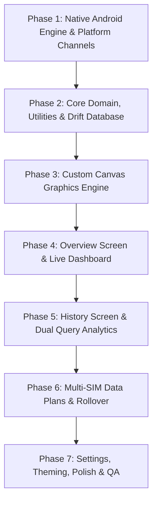

# Master Execution Plan, Architecture, & Design System: ByteMeter

## Goal Description
Rebuild the complete [traffic-light](https://github.com/leekleak/traffic-light) network meter and data usage monitor in **Flutter** (`bytemeter`) with 100% feature parity, stunning Material Expressive UI, real-time Android status bar speed indicator, 90-day historical analytics, multi-SIM data plan tracking, and per-app bandwidth monitoring.

---

## 🎯 Verification & Build Protocol

> [!IMPORTANT]
> - **Static Analysis Verification**: Run `flutter analyze` immediately upon completing each phase. A phase is ONLY considered complete when `flutter analyze` returns with **0 issues found**.
> - **Strictly No APK Builds**: NEVER run `flutter build apk` during execution to avoid long compilation times. Rely strictly on `flutter analyze` and fast unit/widget tests (`flutter test`).
> - **Graphify Visuals**: Every phase, architectural subsystem, and data flow is documented with Graphify / Mermaid diagrams.

---

## Architecture Flow



---

## Complete Project Tree View

```
bytemeter/
├── android/
│   ├── app/
│   │   ├── build.gradle.kts
│   │   └── src/main/
│   │       ├── AndroidManifest.xml
│   │       ├── kotlin/com/bytemeter/network/bytemeter/
│   │       │   ├── MainActivity.kt                       # Flutter activity & channel registration
│   │       │   ├── bridge/
│   │       │   │   ├── ByteMeterPlatformBridge.kt        # MethodChannel & EventChannel handlers
│   │       │   │   └── ChannelConstants.kt               # Method names & event stream IDs
│   │       │   ├── services/
│   │       │   │   ├── ByteMeterForegroundService.kt     # Ongoing foreground service (1s tick)
│   │       │   │   ├── TrafficSnapshotManager.kt         # TrafficStats + active interface listener
│   │       │   │   ├── NotificationIconHelper.kt         # Dynamic Canvas bitmap speed renderer
│   │       │   │   ├── WarningNotificationHelper.kt      # Quota budget & safety warning notifications
│   │       │   │   └── AutoStarter.kt                    # BOOT_COMPLETED receiver
│   │       │   ├── stats/
│   │       │   │   ├── NetworkStatsHelper.kt             # NetworkStatsManager query implementation
│   │       │   │   └── AppListHelper.kt                  # PackageManager app info & icon extractor
│   │       │   └── crypto/
│   │       │       └── CryptoManager.kt                  # Android KeyStore AES-GCM & HMAC-SHA256
│   │       └── res/
│   │           ├── drawable/
│   │           │   ├── notification.xml                  # Base notification silhouette icon
│   │           │   ├── mobiledata_arrows.xml             # Fallback mobile indicator
│   │           │   └── sim_card.xml                      # SIM slot badge icon
│   │           └── values/
│   │               ├── strings.xml
│   │               └── colors.xml
│   ├── build.gradle.kts
│   └── settings.gradle.kts
│
├── assets/
│   ├── fonts/                                            # Google Sans / Inter variable font assets
│   └── icons/                                            # Custom SVG / vector icons
│
├── lib/
│   ├── main.dart                                         # App bootstrap, Riverpod/Provider scope init
│   └── src/
│       ├── app.dart                                      # MaterialApp, DynamicColorBuilder & Theme
│       │
│       ├── core/
│       │   ├── constants/
│       │   │   ├── app_constants.dart                    # Polling intervals, default thresholds
│       │   │   └── special_uids.dart                     # UID_ALL (-100), UID_TETHERING (-5), etc.
│       │   ├── theme/
│       │   │   ├── app_theme.dart                        # Light, Dark, AMOLED & Material You themes
│       │   │   ├── color_schemes.dart                    # Expressive tonal palettes & gradients
│       │   │   └── typography.dart                       # Google Sans typographic styles
│       │   ├── utils/
│       │   │   ├── data_size.dart                        # DataSize converter (Bits/Bytes, Decimal/Binary)
│       │   │   ├── date_utils.dart                       # Timespan, month/day labels, timestamp math
│       │   │   ├── haptics.dart                          # Haptic feedback wrapper
│       │   │   └── size_measurer.dart                    # Canvas & TextMeasurer helpers
│       │   └── native/
│       │       ├── platform_channel.dart                 # Flutter MethodChannel client
│       │       ├── native_traffic_bridge.dart            # Native stats API interface
│       │       └── speed_stream_listener.dart            # EventChannel stream for live speed ticks
│       │
│       ├── data/
│       │   ├── models/
│       │   │   ├── usage_data.dart                       # Upload, Download, Total, Start, End
│       │   │   ├── app_info.dart                         # UID, Package, Label, IconBytes, SpecialType
│       │   │   ├── app_usage.dart                        # AppInfo + DayUsage
│       │   │   ├── data_plan.dart                        # SIM Plan, Quota, Dates, Interval, Rollover
│       │   │   ├── data_plan_extra.dart                  # Addon extra pack (amount, expiry)
│       │   │   ├── traffic_snapshot.dart                 # Instantaneous upload/download speed snapshot
│       │   │   └── enums.dart                            # DataType (Mobile/Wifi), DataDirection, TimeInterval
│       │   ├── database/
│       │   │   ├── app_database.dart                     # Drift / SQLite schema definition
│       │   │   ├── tables/
│       │   │   │   ├── data_plans_table.dart             # DataPlan entity table
│       │   │   │   └── extra_packs_table.dart            # Extra addon packs table
│       │   │   └── converters/
│       │   │       └── type_converters.dart              # TypeConverters for Lists & Custom enums
│       │   └── repositories/
│       │       ├── network_usage_repository.dart         # Query today, week, 90-day, & per-app stats
│       │       ├── data_plan_repository.dart             # CRUD for SIM Plans, rollover, budget math
│       │       └── preferences_repository.dart           # SharedPreferences wrapper for app settings
│       │
│       ├── features/
│       │   ├── overview/
│       │   │   ├── overview_screen.dart                  # Hero, Prediction, Trend, Top Apps, This Week
│       │   │   ├── overview_controller.dart              # Riverpod StateNotifier / Controller
│       │   │   ├── widgets/
│       │   │   │   ├── hero_geometric_gauge.dart         # 12-sided rotating cookie Hero canvas
│       │   │   │   ├── prediction_card.dart              # 4-week hour-ratio predicted daily total
│       │   │   │   ├── trend_card.dart                   # 7-day moving average trend percentage
│       │   │   │   └── network_type_toggle_group.dart    # Cellular vs. Wi-Fi pill toggle
│       │   │
│       │   ├── history/
│       │   │   ├── history_screen.dart                   # 90-day timeline, Dual query filters, Lists
│       │   │   ├── history_controller.dart               # Timeline state, selected date, filter queries
│       │   │   ├── widgets/
│       │   │   │   ├── history_filter_bottom_sheet.dart  # Primary & Secondary query configuration
│       │   │   │   ├── history_legend_badge.dart         # Dual colored query legend badges
│       │   │   │   ├── app_list_view.dart                # Ranked App list with comparative bars
│       │   │   │   ├── hour_list_view.dart               # 2-hour interval time bucket list
│       │   │   │   ├── app_item_card.dart                # Expandable item (Quick Filter, Open App)
│       │   │   │   └── app_search_modal.dart             # Search modal with priority streaming apps
│       │   │
│       │   ├── data_plans/
│       │   │   ├── data_plans_screen.dart                # Horizontal SIM card carousel + Insights
│       │   │   ├── plan_config_screen.dart               # Edit plan limit, cycle, rollover, exclusions
│       │   │   ├── plans_controller.dart                 # Data plan state, snapshots, budget math
│       │   │   ├── widgets/
│       │   │   │   ├── sim_card_pager.dart               # Swipeable multi-SIM card views
│       │   │   │   ├── data_safety_card.dart             # Safe, Neutral, Unsafe ratio badge
│       │   │   │   ├── daily_budget_card.dart            # Remaining daily budget & today remaining
│       │   │   │   ├── extra_packs_grid.dart             # Addon pack progress cards
│       │   │   │   └── excluded_apps_picker.dart         # Zero-rated apps selection sheet
│       │   │
│       │   ├── settings/
│       │   │   ├── settings_screen.dart                  # General, Notification, Appearance, Permissions
│       │   │   ├── notification_settings_screen.dart     # Status bar icon style, AOD mode, Thresholds
│       │   │   ├── settings_controller.dart              # Reactive settings state
│       │   │   └── widgets/
│       │   │       ├── permission_status_card.dart       # Usage Access & Battery optimization cards
│       │   │       ├── theme_selector_tile.dart          # Dynamic / Light / Dark / AMOLED picker
│       │   │       └── unit_format_tiles.dart            # Bits/Bytes, 1000/1024 switches
│       │   │
│       │   └── charts/
│       │       ├── weekly_bar_chart.dart                 # Interactive Weekly Mon-Sun Bar CustomPainter
│       │       ├── scrollable_bar_chart.dart             # 90-Day Fling-Scrollable Canvas Bar Graph
│       │       ├── comparative_line_chart.dart           # Dual comparative bar with shader text mask
│       │       ├── app_usage_bar_chart.dart              # Proportional stacked bars with text fitting
│       │       └── extra_pack_progress_chart.dart        # Addon pack ring/linear canvas progress
│       │
│       └── widgets/
│           ├── haze_scaffold.dart                        # Frosted glass background blur scaffold
│           ├── mini_card.dart                            # Standardized insight card container
│           ├── custom_button_group.dart                  # Material Expressive segmented buttons
│           └── live_speed_badge.dart                     # Real-time transfer rate badge
│
└── test/
    ├── unit/
    │   ├── data_size_test.dart                           # Conversions & formatting tests
    │   ├── analytics_math_test.dart                      # Prediction & Trend algorithm tests
    │   ├── plan_budget_test.dart                         # Rollover, safety ratio, budget tests
    │   └── uid_reconciliation_test.dart                  # Special UIDs & device delta test
    └── widget/
        ├── overview_screen_test.dart
        ├── history_screen_test.dart
        └── data_plans_screen_test.dart
```

---

## Packages & Dependencies (`pubspec.yaml`)

| Package | Version | Purpose |
|---|---|---|
| **`flutter_riverpod`** | `^2.6.1` | Reactive state management for real-time speed, usage stats, and settings |
| **`drift`** | `^2.24.2` | High-performance, type-safe SQLite database for DataPlans & Extra packs |
| **`sqlite3_flutter_libs`** | `^0.5.28` | Native SQLite libraries bundled for Android |
| **`path_provider`** | `^2.1.5` | Resolves database and application documents directory paths |
| **`shared_preferences`** | `^2.3.5` | Fast key-value persistence for app configuration, units, and flags |
| **`dynamic_color`** | `^1.7.0` | Material You Android dynamic color scheme harmonization |
| **`google_fonts`** | `^6.2.1` | Typography support matching Google Sans / expressive weights |
| **`intl`** | `^0.20.2` | Date formatting, time bucket labels, and localization |
| **`cupertino_icons`** | `^1.0.8` | Standard supplementary icons |

---

## Design System & Architecture Specifications

### 1. Color System (Material You & Expressive Palette)
- **Dynamic Color**: Automatically extracts system wallpaper palette on Android 12+ using `dynamic_color`.
- **Theme Modes**:
  - `AutoMaterial`: Dynamic Light / Dark based on system
  - `LightMaterial` / `DarkMaterial`: Explicit Material You schemes
  - `AMOLED`: Deep pitch-black surface `#000000` with high-contrast vibrant accents for OLED power savings.
- **Visual Frosted Glass (Haze Scaffold)**: Translucent top app bar with background backdrop blur filter (`BackdropFilter` with `ImageFilter.blur(sigmaX: 16, sigmaY: 16)`).

### 2. Typography & Text Measurement
- Expressive rounded typography for numeric metrics.
- Binary Search Text Fitting: For `AppGraph`, text size is measured dynamically via `TextPainter` to ensure strings like `1.24 GB` seamlessly fit within variable-length horizontal bars.

### 3. Native Background Engine & Platform Channels
- **`MethodChannel` (`com.bytemeter/bridge`)**:
  - `queryDeviceSummary(type, subscriberId, start, end)`
  - `queryAppBuckets(type, subscriberId, start, end)`
  - `queryHourlyBuckets(type, subscriberId, start, end, uid)`
  - `getInstalledApps()` (Package name, app label, icon bytes)
  - `startService()`, `stopService()`, `updateServiceSettings()`
  - `hasUsagePermission()`, `requestUsagePermission()`, `ignoreBatteryOptimizations()`
- **`EventChannel` (`com.bytemeter/speed_stream`)**:
  - Streams real-time `TrafficSnapshot(uploadBytesPerSec, downloadBytesPerSec)` every second to Flutter UI.
- **Native Status Bar Renderer (`NotificationIconHelper.kt`)**:
  - Android `Canvas` renders speed digits (e.g. `24 KB` / `1.5 MB`) onto a $96 \times 96$ density-scaled `Bitmap`.
  - Sets `IconCompat.createWithBitmap(bitmap)` as `smallIcon` in the ongoing notification.

---

## Phase-by-Phase Implementation Plan

### Phase 1: Native Android Background Engine & Platform Channels
- **Step 1.1**: Add native permissions & service declarations to `AndroidManifest.xml`.
- **Step 1.2**: Implement `TrafficSnapshotManager.kt` with active interface callback and delta calculations.
- **Step 1.3**: Implement `NotificationIconHelper.kt` for live status bar numeric bitmap drawing.
- **Step 1.4**: Implement `ByteMeterForegroundService.kt` with screen-state broadcast listener and tick loop.
- **Step 1.5**: Implement `NetworkStatsHelper.kt` and `AppListHelper.kt`.
- **Step 1.6**: Implement `ByteMeterPlatformBridge.kt` connecting MethodChannel & EventChannel.

---

### Phase 2: Core Domain Layer, Utilities & Drift Database
- **Step 2.1**: Update `pubspec.yaml` with dependencies.
- **Step 2.2**: Implement `data_size.dart` with Decimal/Binary metrics and 3-part formatting.
- **Step 2.3**: Implement domain data models (`UsageData`, `AppInfo`, `DataPlan`, `DataPlanExtra`, `TrafficSnapshot`).
- **Step 2.4**: Implement Drift SQLite Database (`app_database.dart`) with tables for Data Plans and Extra Addon packs.
- **Step 2.5**: Implement `NetworkUsageRepository`, `DataPlanRepository`, and `PreferencesRepository`.

---

### Phase 3: Custom Canvas Graphics Engine
- **Step 3.1**: Implement `hero_geometric_gauge.dart` (12-sided rotating shape with radial glow and spring scale).
- **Step 3.2**: Implement `weekly_bar_chart.dart` (Mon-Sun custom painter with dash grid and tap squeeze).
- **Step 3.3**: Implement `scrollable_bar_chart.dart` (90-day fling scroll with snap physics).
- **Step 3.4**: Implement `comparative_line_chart.dart` (Dual comparative bar with gradient text shader).
- **Step 3.5**: Implement `app_usage_bar_chart.dart` (Horizontal stacked bars with binary-search text fitting).

---

### Phase 4: Overview Screen & Real-Time Dashboard
- **Step 4.1**: Build `OverviewController` (computes 4-week hour ratio prediction, 7-day trend, top 3 apps, and today usage).
- **Step 4.2**: Assemble `OverviewScreen` with Hero Gauge, Prediction Card, Trend Card, Top Apps Graph, and Weekly Summary Chart.
- **Step 4.3**: Integrate live speed ticker from Native EventChannel.

---

### Phase 5: History Screen & Dual Query Comparison
- **Step 5.1**: Build `HistoryController` (maintains 90-day timeline cache, date selection, and dual comparison queries).
- **Step 5.2**: Build `HistoryFilterBottomSheet` (Primary & Secondary query dropdowns: Wi-Fi/Mobile, Up/Down, App A/App B).
- **Step 5.3**: Build `AppListView` (Ranked app list with comparative line charts, Quick Filter, and Open App action).
- **Step 5.4**: Build `HourListView` (2-hour bucket timeline breakdown).
- **Step 5.5**: Build `AppSearchModal` with priority zero-rated candidate app sorting.

---

### Phase 6: Multi-SIM Data Plans, Rollover & Budget Insights
- **Step 6.1**: Build `PlansController` with `DataPlanLogic` (Time vs Consumption DataSafety, dynamic remaining daily budget, rollover extras).
- **Step 6.2**: Build `DataPlansScreen` with swipeable multi-SIM PageView cards.
- **Step 6.3**: Build `PlanConfigScreen` (Configure data limit in MB/GB/TB, billing start date, monthly/daily cycle, rollover toggle, zero-rated excluded apps).
- **Step 6.4**: Build Addon Extra Pack management cards.

---

### Phase 7: Settings, Permissions, Polish & QA
- **Step 7.1**: Build `SettingsScreen` (Units: Bits vs Bytes, 1000 vs 1024; Theme: Material You, Light, Dark, AMOLED; Blur toggle).
- **Step 7.2**: Build `NotificationSettingsScreen` (Status bar icon mode, separate Up/Down rates, silent speed threshold, AOD mode).
- **Step 7.3**: Build Permission Dashboard (Usage Access grant intent, Battery optimization exemption).
- **Step 7.4**: Comprehensive automated testing (`flutter test`, `flutter analyze`).

---

## Verification Plan

```bash
# 1. Static Analysis (Run after EACH phase)
flutter analyze

# 2. Run All Unit Tests (DataSize, Prediction Math, DataSafety, Budget Logic)
flutter test test/unit/

# 3. Run Screen & Widget Smoke Tests
flutter test test/widget/
```
