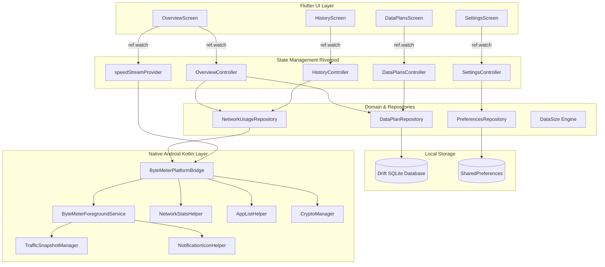

# ByteMeter: Documentation Hub

Welcome to the **ByteMeter** engineering documentation suite. ByteMeter is a modern, privacy-focused network bandwidth meter and mobile data usage tracker built with Flutter and Native Android Kotlin.

---

## 🎯 Verification & Build Protocol

> [!IMPORTANT]
> **Static Analysis After Every Phase**: Run `flutter analyze` immediately upon completing each phase. Code will only be marked complete once 0 errors and 0 warnings are achieved.
> **No APK Builds**: NEVER run `flutter build apk` during iterative development. Verification relies purely on `flutter analyze` and fast unit/widget tests (`flutter test`).
> **Graphify / Mermaid Visuals**: All phase architectures, data pipelines, and component relationships are mapped using Graphify / Mermaid diagrams.

---

## 📚 Documentation Index

| Document | Description |
|---|---|
| 🏛️ [**MVVM & Clean Architecture**](architecture-mvvm.md) | Architectural specification of the Model-View-ViewModel (Controller) pattern, unidirectional reactive data flow with Riverpod, and repository abstractions. |
| 📋 [**Phase-by-Phase Execution Plan**](phases.md) | 7-Phase implementation roadmap with interactive markdown feature checklists (`- [ ]`) from native Android service to UI polish. |
| 🌳 [**Complete Project Tree View**](project-tree-view.md) | Exhaustive directory and file structure breakdown detailing every file in `lib/`, `android/`, `assets/`, `test/`, and `docs/`. |
| 📦 [**Dependencies & Packages Specification**](packages.md) | Detailed breakdown of all runtime and development packages (`flutter_riverpod`, `drift`, `sqlite3_flutter_libs`, `dynamic_color`, `google_fonts`, `shared_preferences`, etc.), version constraints, and technical rationale. |
| 🎨 [**UI/UX Design System & Canvas Engines**](design.md) | Design specifications: Material You dynamic theming, AMOLED pitch-black mode, frosted glass backdrop filters, typography text-fitting algorithms, custom canvas graphs, and native Android foreground notification speed rendering. |
| 🛠️ [**Flutter Engineering Skills & Practices**](flutter-skills.md) | Specialized Flutter and Android skills: CustomPainter shaders, matrix animations, velocity fling physics, Drift SQLite streams, platform channels, and Android CLI integration. |
| 🔌 [**Dart & Flutter MCP Integration**](dart-mcp-skills.md) | Model Context Protocol (MCP) server integration for Dart Analysis Server, Flutter DevTools, pub.dev API, and automated code generation. |

---

## 🚀 Graphify System Architecture Overview

---

## 🛠️ Tech Stack Summary

- **Framework**: Flutter 3.47.0 (Channel stable, Dart 3.13.0)
- **Target OS**: Android 12+ (minSdk 28, targetSdk 37)
- **State Management**: `flutter_riverpod` (v2.6.1)
- **Local Relational Database**: `drift` (v2.24.2) + `sqlite3_flutter_libs`
- **Settings Store**: `shared_preferences` (v2.3.5)
- **Design System**: Material Design 3 Expressive + `dynamic_color` (v1.7.0)
- **Native Android Layer**: Kotlin 2.4.0, AGP 9.1.0, JVM 17, `NetworkStatsManager`, `TrafficStats`, Keystore AES-GCM
