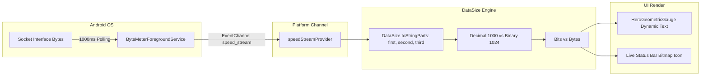

# ByteMeter: MVVM + Clean Architecture Specification

## Goal Description
Establish the **MVVM (Model-View-ViewModel / Notifier)** Clean Architecture pattern for **ByteMeter**. This pattern strictly separates business logic, mathematical algorithms, native platform queries, and data persistence from the declarative Flutter UI layer, ensuring high testability, maintainability, and reactive performance.

---

## 🎯 Verification & Build Protocol

> [!IMPORTANT]
> - **Static Analysis Verification**: Run `flutter analyze` immediately upon completing each phase. A phase is ONLY considered complete when `flutter analyze` returns with **0 issues found**.
> - **Strictly No APK Builds**: NEVER run `flutter build apk` during execution to avoid long compilation times. Rely strictly on `flutter analyze` and fast unit/widget tests (`flutter test`).
> - **Graphify Visuals**: Every architectural layer and data flow is visualized via Graphify / Mermaid diagrams.

---

## 1. MVVM Architecture Flow

```mermaid
graph TD
    subgraph View Layer [Flutter Declarative UI]
        Screens[Screens: Overview, History, DataPlans, Settings]
        CustomPainters[Custom Painters & Charts]
        Widgets[Reusable Cards & Segmented Buttons]
    end

    subgraph ViewModel / Controller Layer [State Notifiers & Business Logic]
        OverviewVM[OverviewController: Prediction Math & Trend Calculations]
        HistoryVM[HistoryController: 90-Day Timeline & Dual Query Filtering]
        PlansVM[PlansController: DataSafety Ratios, Daily Budget & Rollover]
        SettingsVM[SettingsController: Theme, Speed Units, Preferences]
    end

    subgraph Model & Data Layer [Repositories & Relational Storage]
        UsageRepo[NetworkUsageRepository]
        PlanRepo[DataPlanRepository]
        PrefsRepo[PreferencesRepository]
        DriftDB[(Drift SQLite Database)]
        NativeBridge[Native Platform Channels Bridge]
    end

    Screens -->|Observes State (ref.watch)| OverviewVM
    Screens -->|Observes State (ref.watch)| HistoryVM
    Screens -->|Observes State (ref.watch)| PlansVM
    Screens -->|Observes State (ref.watch)| SettingsVM
    
    Screens -->|Sends User Actions (e.g. toggleWifi())| OverviewVM
    Screens -->|Sends User Actions (e.g. updateFilter())| HistoryVM
    Screens -->|Sends User Actions (e.g. savePlan())| PlansVM

    OverviewVM --> UsageRepo
    HistoryVM --> UsageRepo
    PlansVM --> PlanRepo
    SettingsVM --> PrefsRepo

    UsageRepo --> NativeBridge
    PlanRepo --> DriftDB
    PrefsRepo --> NativeBridge
```

---

## 2. Reactive Speed Stream & Formatting Pipeline



---

## 3. Directory Structure by MVVM Layer

```
lib/src/
├── core/                                         # Core utilities, constants & design tokens
│   ├── constants/                                # System UIDs, polling durations
│   ├── theme/                                    # Material You, AMOLED & typography
│   ├── utils/                                    # DataSize formatters, date utilities, haptics
│   └── native/                                   # Platform channel client wrappers
│
├── data/                                         # MODEL LAYER (Entities, DB & Repositories)
│   ├── models/                                   # Domain Entities / Data Classes
│   │   ├── usage_data.dart                       # Immutable data transfer object (tx, rx, total)
│   │   ├── app_info.dart                         # Package metadata, label, UID, icon bytes
│   │   ├── app_usage.dart                        # AppInfo + DayUsage
│   │   ├── data_plan.dart                        # Multi-SIM quota entity
│   │   ├── data_plan_extra.dart                  # Addon extra pack entity
│   │   └── traffic_snapshot.dart                 # Real-time sub-second transfer rate
│   ├── database/                                 # Local SQLite Persistence
│   │   ├── app_database.dart                     # Drift database schema definition
│   │   ├── tables/                               # Relational SQL table definitions
│   │   └── converters/                           # TypeConverters for enums and JSON
│   └── repositories/                             # Repository Pattern Implementations
│       ├── network_usage_repository.dart         # Interfaces with Native NetworkStats
│       ├── data_plan_repository.dart             # CRUD for SIM plans and addon packs
│       └── preferences_repository.dart           # Persistent app settings
│
└── features/                                     # VIEW & VIEWMODEL LAYERS (By Feature)
    ├── overview/
    │   ├── overview_screen.dart                  # [VIEW] Dashboard layout
    │   ├── overview_controller.dart              # [VIEWMODEL] Prediction & Trend calculations
    │   ├── overview_state.dart                   # [STATE] Immutable UI state
    │   └── widgets/                              # [VIEW COMPONENTS]
    │       ├── hero_geometric_gauge.dart
    │       ├── prediction_card.dart
    │       └── trend_card.dart
    │
    ├── history/
    │   ├── history_screen.dart                   # [VIEW] 90-day timeline & analytics
    │   ├── history_controller.dart               # [VIEWMODEL] Dual query filter engine
    │   ├── history_state.dart                    # [STATE] Selected date, active queries
    │   └── widgets/                              # [VIEW COMPONENTS]
    │       ├── app_list_view.dart
    │       ├── hour_list_view.dart
    │       └── history_filter_bottom_sheet.dart
    │
    ├── data_plans/
    │   ├── data_plans_screen.dart                # [VIEW] Multi-SIM carousel & quota cards
    │   ├── plan_config_screen.dart               # [VIEW] Configure quota & rollover
    │   ├── plans_controller.dart                 # [VIEWMODEL] DataSafety & Daily budget logic
    │   ├── plans_state.dart                      # [STATE] Active SIM plans & snapshots
    │   └── widgets/                              # [VIEW COMPONENTS]
    │       ├── sim_card_pager.dart
    │       ├── data_safety_card.dart
    │       └── daily_budget_card.dart
    │
    ├── settings/
    │   ├── settings_screen.dart                  # [VIEW] Settings dashboard
    │   ├── notification_settings_screen.dart     # [VIEW] Status bar icon config
    │   ├── settings_controller.dart              # [VIEWMODEL] Unit & theme state management
    │   └── widgets/                              # [VIEW COMPONENTS]
    │       ├── permission_status_card.dart
    │       └── theme_mode_selector.dart
    │
    └── charts/                                   # [VIEW] CustomPainter Visual Engines
        ├── weekly_bar_chart.dart
        ├── scrollable_bar_chart.dart
        ├── comparative_line_chart.dart
        └── app_usage_bar_chart.dart
```

---

## 4. Layer-by-Layer Responsibilities

| Layer | Responsibility | Key Characteristics |
|---|---|---|
| **View (`*.dart` Screens & Widgets)** | Renders UI, catches user gestures (taps, flings, inputs), and binds to ViewModels via `ref.watch()`. | Zero business logic, purely declarative, reacts to immutable state changes. |
| **ViewModel (`*_controller.dart`)** | Manages UI state, executes mathematical formulas (Prediction, Trend, DataSafety, Budget distribution), and orchestrates Repository calls. | Extends Riverpod `StateNotifier<T>` or `Notifier<T>`, context-independent, 100% unit-testable. |
| **Model (`data/models/`)** | Defines immutable domain entities and business rules (e.g. `DataSize` arithmetic, `UsageData` totals). | Pure Dart data classes with copyWith and JSON serialization. |
| **Repository (`data/repositories/`)** | Abstracts data sources, unifying Drift SQLite database queries and native Android Platform Channel RPCs. | Single Source of Truth for the ViewModels. |

---

## 5. Verification Plan

```bash
# 1. Static Analysis (Enforce 0 errors and 0 warnings after each phase)
flutter analyze

# 2. Run unit tests for ViewModels, Repositories, and Mathematical Algorithms
flutter test test/unit/

# 3. Run widget tests verifying View bindings
flutter test test/widget/
```
