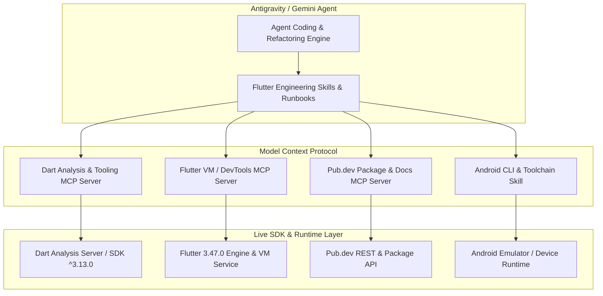
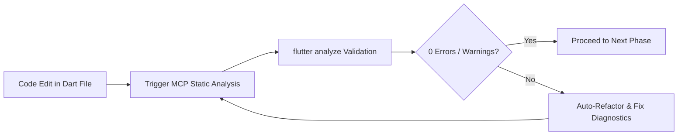

# Dart & Flutter MCP (Model Context Protocol) & Skills Integration Plan

## Goal Description
Detail the role, architecture, configuration, and practical usage of **Dart & Flutter MCP (Model Context Protocol)** servers and **Flutter Skills** within the **ByteMeter** project. This establishes how AI agents interact with the Dart SDK, Flutter toolchain, DevTools, pub.dev API, and Android CLI to deliver flawless, high-speed development.

---

## 🎯 Verification & Build Protocol

> [!IMPORTANT]
> - **Static Analysis Verification**: Run `flutter analyze` immediately upon completing each phase. A phase is ONLY considered complete when `flutter analyze` returns with **0 issues found**.
> - **Strictly No APK Builds**: NEVER run `flutter build apk` during execution to avoid long compilation times. Rely strictly on `flutter analyze` and fast unit/widget tests (`flutter test`).
> - **Graphify Visuals**: All MCP integrations and agent tooling workflows are mapped with Graphify / Mermaid diagrams.

---

## 1. What is Dart / Flutter MCP & Skills?



---

## 2. Core Capabilities of Dart & Flutter MCP

| Tool / Capability | Protocol / Source | Purpose in ByteMeter Development |
|---|---|---|
| **Dart Analysis Server** | `dart-mcp` | Semantic symbol navigation, real-time static analysis, automatic imports, and compiler diagnostics. |
| **Flutter DevTools & VM Service** | `flutter-mcp` | Widget tree inspection, layout debugging, memory leak detection, and triggering hot reload / hot restart. |
| **Pub.dev Package Resolver** | `pub-mcp` | Querying pub.dev for package metadata, changelogs, breaking change alerts, and version constraints. |
| **Android CLI Specialist** | `android-cli` | Querying Android developer docs (`android docs search`), managing emulators, capturing layout trees (`android layout`), and taking screenshots. |

---

## 3. How Dart MCP Augments Flutter Development



### 3.1 Real-Time Code Intelligence & Refactoring
- **Semantic Code Actions**: Identifies widget refactoring opportunities (e.g., converting `StatelessWidget` to `ConsumerWidget`, wrapping with `LayoutBuilder`, extracting `CustomPainter`).
- **Linter Enforcement**: Integrates with `flutter_lints` to enforce strict typing, const constructor usage, and avoidance of mutable state in widgets.

### 3.2 Automated Drift Code Generation & Verification
- Executes `build_runner build --delete-conflicting-outputs` automatically upon editing Drift tables or Riverpod code generators.
- Verifies that generated Dart files (`app_database.g.dart`) compile without warnings.

### 3.3 Dynamic Layout & Frame Performance Inspection
- Interrogates the Flutter render tree to detect overdrawn canvas layers in custom painters (`HeroGeometricGauge`, `ScrollableBarChart`).
- Uses `android layout --pretty` to verify Android native views rendered by the foreground service.

---

## 4. MCP Configuration for the Project

To equip the agent with custom Dart/Flutter MCP capabilities in the workspace, we configure `.agents/mcp_config.json`:

```json
{
  "mcpServers": {
    "dart-analyzer": {
      "command": "dart",
      "args": ["language-server", "--protocol=lsp"]
    },
    "flutter-tools": {
      "command": "flutter",
      "args": ["daemon"]
    }
  }
}
```

---

## 5. Verification Plan

```bash
# 1. Run Flutter Static Analyzer (After Every Phase)
flutter analyze

# 2. Verify Dart test runner
flutter test

# 3. Check Android CLI status
android info
```
