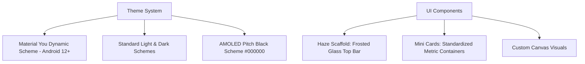
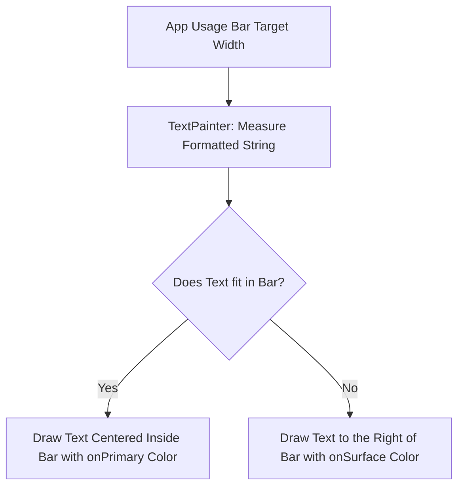
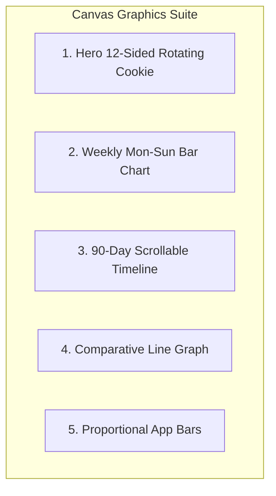
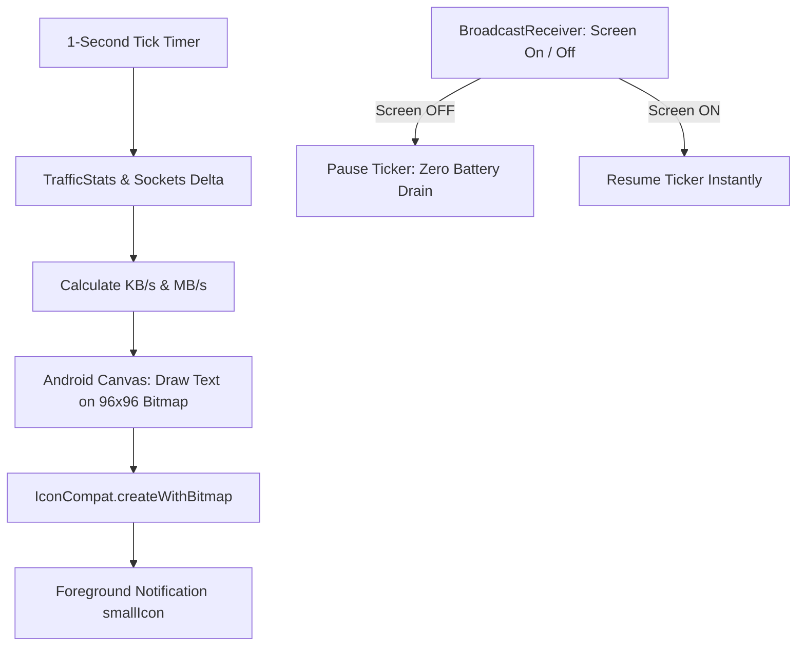

# ByteMeter: UI/UX Design System, Canvas Engines & Architecture

This document specifies the design system, typography, color palettes, custom canvas rendering engines, and native background architecture for **ByteMeter**.

---

## 🎯 Verification & Build Protocol

> [!IMPORTANT]
> - **Static Analysis Verification**: Run `flutter analyze` immediately upon completing each phase. A phase is ONLY considered complete when `flutter analyze` returns with **0 issues found**.
> - **Strictly No APK Builds**: NEVER run `flutter build apk` during execution to avoid long compilation times. Rely strictly on `flutter analyze` and fast unit/widget tests (`flutter test`).
> - **Graphify Visuals**: Every visual engine, canvas pipeline, and math model is visualized via Graphify / Mermaid diagrams.

---

## 1. Design System & Theming

### 1.1 Color Palettes & Modes

#### Dynamic Theming (`dynamic_color`)
On Android 12+ (API 31+), the color palette is automatically derived from the user's active device wallpaper, harmonizing the primary, secondary, and surface containers with the operating system.

#### Theme Modes:
1. **`Auto Material`**: Dynamically switches between Light and Dark Material You schemes based on system settings.
2. **`Light Material`**: Clean, vibrant light surface tones with high legibility.
3. **`Dark Material`**: Muted dark surface tones reducing eye strain in low-light environments.
4. **`AMOLED Mode`**: Pure pitch-black surface (`#000000`) designed specifically for OLED displays to eliminate pixel illumination and maximize battery life.

---

### 1.2 Translucent Frosted Glass (`HazeScaffold`)
- **Visual Appearance**: Translucent top app bar with subtle background blur filter (`BackdropFilter` with `ImageFilter.blur(sigmaX: 16.0, sigmaY: 16.0)`).
- **Behavior**: As the user scrolls through History or Data Plans, underlying card content smoothly blurs beneath the status bar and navigation title.
- **Configurable**: Users can toggle the blur effect on or off in Settings for lower-end GPU optimization.

---

### 1.3 Typography & Text-Fitting Engine

- **Font Family**: Google Sans Rounded / Inter variable typography.
- **Hero Numeric Metrics**:
  - `Integer Part`: Huge expressive font size (e.g. `96sp` to `100sp`) with heavier weight (`FontWeight.w700`).
  - `Decimal Part`: Proportionately scaled secondary font size (e.g. `42sp`).
  - `Unit Label`: Compact uppercase badge (e.g. `GB`, `MB/s`).
- **Binary Search Text Fitting Algorithm (`AppGraph`)**:
  - Horizontal app bars vary in length depending on data usage.
  - To prevent text clipping inside short bars, a binary-search measurement loop calculates the maximum legible font width using `TextPainter`:
    $$\text{TargetPx} = \text{BarWidth} - 8\text{dp}$$
    $$\text{If font fits within bar} \implies \text{Draw text inside bar}$$
    $$\text{If bar is too small} \implies \text{Draw text immediately outside bar}$$

---

## 2. Custom Canvas Graphics Engines

---

### 2.1 Hero 12-Sided Geometric Gauge Canvas
- **Polygon Geometry**: 12-sided cookie star polygon generated via mathematical trigonometric offsets.
- **Animation Loop**: Continuous subtle 360-degree rotation (50-second cycle) using `LinearEasing`.
- **Radial Glow**: Background circular radial gradient glow that dynamically adapts its hue to the active network type (Primary container for Cellular, Tertiary container for Wi-Fi).
- **Physics Interaction**: Pressing and holding the hero gauge triggers a spring physics scale contraction (`Animatable` spring with `DampingRatioLowBouncy`), paired with tactile haptic tick feedback.

---

### 2.2 Weekly Mon-Sun Interactive Bar Chart
- **Layout**: 7 equal horizontal partitions representing Monday through Sunday.
- **Stacked Dual Bars**:
  - Lower segment: Cellular data usage (Primary color).
  - Upper segment: Wi-Fi data usage (Tertiary color).
- **Background Grid**: Dashed horizontal baseline and vertical dividing ticks.
- **Interactive Touch Physics**:
  - Tapping an individual bar executes a squeeze animation (bar momentarily contracts horizontally before bouncing back).
  - Triggers a context click haptic vibration.
- **Interactive Legend**: Tapping the Wi-Fi or Cellular legend icon triggers a playful vibration bounce animation.

---

### 2.3 90-Day Fling-Scrollable History Bar Chart
- **Time Window**: Displays up to 90 days of continuous historical data.
- **Scroll Physics**: Custom `Scrollable` implementation with `exponentialDecay` velocity physics for smooth flicking.
- **Spring Snapping**: When fling scrolling decelerates below the velocity threshold, a spring animation snaps the nearest day bar directly into alignment with the central selector indicator.
- **Haptics**: Triggers `SegmentFrequentTick` haptic feedback every time a day bar traverses the center line.
- **Viewport Dynamic Scaling**: The y-axis maximum dynamically re-scales based on the peak usage visible within the active viewport.

---

### 2.4 Comparative Line Chart with Gradient Text Shader Mask
- **Use Case**: Comparing Upload vs. Download or Wi-Fi vs. Cellular in History App List items.
- **Dual Proportional Bars**:
  - Left bar grows from left to right (Primary color).
  - Right bar grows from right to left (Tertiary color).
- **Gradient Text Shader**:
  - Text labels (e.g. `1.2 GB · 450 MB`) sit across the horizontal axis.
  - A `Brush.horizontalGradient` shader mask is applied to the text:
    - Text over the filled bar renders in `onPrimary` / `onTertiary` color.
    - Text over the empty background renders in `onSurface` color.
    - Eliminates any contrast issues regardless of where the bar edge lands.

---

## 3. Native Android Status Bar Speed Engine

### 3.1 Sub-Second Speed Snapshot Calculation
- Network sockets and interfaces (`TrafficStats.getTxBytes`, `TrafficStats.getRxBytes`) are sampled every 1000ms.
- Self-calibrating delta calculation:
  $$\text{UploadSpeed} = \max(\text{CurrentTx} - \text{LastTx}, 0) \text{ bytes/sec}$$
  $$\text{DownloadSpeed} = \max(\text{CurrentRx} - \text{LastRx}, 0) \text{ bytes/sec}$$

### 3.2 Dynamic In-Memory Bitmap Generation (`NotificationIconHelper.kt`)
1. Allocates a reusable $96 \times 96$ density-scaled `Bitmap`.
2. Clears previous pixels (`Color.TRANSPARENT`).
3. Uses Android `Canvas` and custom density-scaled `Paint` typography:
   - Draws speed number on line 1 (e.g. `24` or `1.5`).
   - Draws unit label on line 2 (e.g. `KB` or `MB`).
4. Converts the rendered bitmap into an `IconCompat` object.
5. Injects the icon as the notification's `smallIcon`, placing the real-time speed directly inside the Android system status bar.

### 3.3 Power Conservation (Screen State Broadcast)
- A native `BroadcastReceiver` listens for `Intent.ACTION_SCREEN_OFF`.
- When the display is locked (and AOD mode is disabled), polling terminates immediately.
- On `Intent.ACTION_SCREEN_ON`, monitoring resumes instantly.
- Results in virtually **zero background battery drain** when the phone is in a pocket or idle.

---

## 4. Mathematical Analytics & Predictions

### 4.1 End-of-Day Usage Prediction
$$\text{Prediction} = \text{TodayUsage} + \left(\text{Last24hUsage} \times \left(\frac{\sum_{i=1}^4 \text{FullDayUsage}_{t-i\cdot 7d}}{\sum_{i=1}^4 \text{ElapsedDayUsage}_{t-i\cdot 7d}} - 1\right)\right)$$
- Samples historical data from the identical weekday over the prior 4 weeks.
- Multiplies the current burn rate by the historical ratio of afternoon/evening traffic versus morning traffic.

### 4.2 7-Day Moving Trend Percentage
$$\text{Trend \%} = \left(\frac{\text{HourlyAverage}_{\text{last 24h}}}{\max(\text{HourlyAverage}_{\text{prior 6 days}}, 1.0)} - 1\right) \times 100$$
- Compares the last 24-hour hourly burn rate against the prior 6-day baseline.

### 4.3 Data Plan Safety Indicator
$$\Delta = \frac{\text{DataUsed}}{\text{TotalQuota}} - \frac{\text{TimeElapsedInBillingCycle}}{\text{TotalCycleDuration}}$$
- $\Delta \le 0.0$ or $\text{Usage} < 10\% \implies \textbf{Safe (Positive / Green)}$
- $\Delta \le 0.1 \implies \textbf{Neutral (Yellow)}$
- $\Delta > 0.1$ or $\text{Usage} > 95\% \implies \textbf{Unsafe (Negative / Red)}$

### 4.4 Dynamic Remaining Daily Budget
$$\text{DailyBudget} = \frac{\max(\text{TotalQuota} - \text{DataUsed}, 0)}{\text{DaysRemainingInCycle} + 1}$$
$$\text{TodayRemainingBudget} = \max(\text{DailyBudget} - \text{TodayUsage}, 0)$$
- Automatically distributes unspent data allowance evenly across the remaining days in the cycle.
