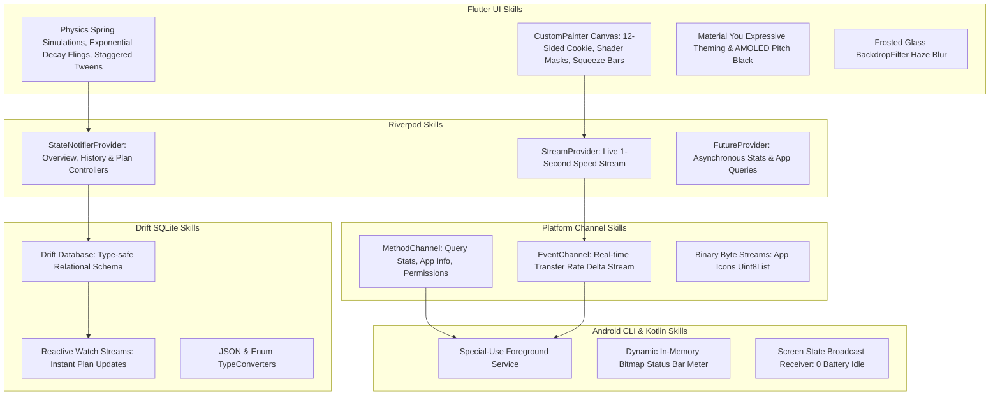
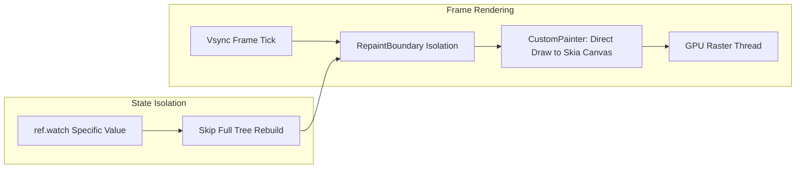

# Flutter Engineering Skills & Execution Blueprint: ByteMeter

## Goal Description
Integrate specialized **Flutter Engineering Skills** and Android system capabilities into the **ByteMeter** project. This document defines the engineering standards, architecture patterns, graphics algorithms, platform channel bridges, and testing methodologies that will be applied throughout the project.

---

## 🎯 Verification & Build Protocol

> [!IMPORTANT]
> - **Static Analysis Verification**: Run `flutter analyze` immediately upon completing each phase. A phase is ONLY considered complete when `flutter analyze` returns with **0 issues found**.
> - **Strictly No APK Builds**: NEVER run `flutter build apk` during execution to avoid long compilation times. Rely strictly on `flutter analyze` and fast unit/widget tests (`flutter test`).
> - **Graphify Visuals**: All skills, rendering pipelines, and state flows are mapped with Graphify / Mermaid diagrams.

---

## 1. Applied Flutter Skills & Architecture Stack



---

## 2. High-Performance Zero-Jank Rendering Pipeline



---

## 3. Deep-Dive into Specialized Flutter Skills

### 3.1 Custom Canvas Graphics & Shader Skills
- **Matrix Transformation & Polygon Mathematics**:
  - The 12-sided geometric cookie Hero is generated via mathematical trigonometric vertex equations rotated via `Matrix4`.
- **Text Color Inversion via Shaders (`ShaderMask` / `Brush.horizontalGradient`)**:
  - In `ComparativeLineChart`, text labels spanning filled and empty bar sections use a dynamic horizontal gradient brush to automatically invert color:
    ```dart
    final shader = ui.Gradient.linear(
      Offset(0, 0),
      Offset(size.width, 0),
      [onPrimaryColor, onPrimaryColor, onBackgroundColor, onBackgroundColor],
      [0.0, splitPoint, splitPoint + 0.01, 1.0],
    );
    ```
- **Dynamic Binary-Search Text Measurer (`AppUsageBarChart`)**:
  - Prevents text clipping in horizontal bars by using `TextPainter.layout()` in a binary search loop to compute the largest legible font size fitting within the bar width.

---

### 3.2 Advanced Gesture & Fling Physics Skills (`ScrollableBarChart`)
- **Velocity-Decay Scrolling**:
  - Uses `ScrollPhysics` with an `exponentialDecay` simulation for high-inertia horizontal scrolling across 90 days.
- **Spring Snapping**:
  - When velocity drops below threshold, a `SpringSimulation` snaps the nearest day bar directly into the center selector indicator with a bouncy spring curve (`DampingRatioLowBouncy`).
- **Tactile Haptics**:
  - Triggers `HapticFeedback.selectionClick()` dynamically as each date crosses the center axis.

---

### 3.3 Unidirectional State Management Skills (Flutter Riverpod)
- **Feature-First Controller Pattern**:
  - `OverviewController` (computes 4-week hour ratio prediction and 7-day trend).
  - `HistoryController` (maintains 90-day timeline cache and dual comparison queries).
  - `PlansController` (evaluates Data Safety ratios, daily budget distribution, and rollover).
  - `SettingsController` (persists unit toggles, notification styles, and themes).
- **Zero BuildContext Coupling**:
  - Business logic and math algorithms live entirely within pure Dart controllers, making them 100% unit-testable without widget trees.

---

### 3.4 High-Performance Local Database Skills (Drift / SQLite)
- **Compile-Time Verification**:
  - Relational schema for Multi-SIM plans and Extra Addon packs verified at compile-time with `drift_dev`.
- **Reactive Stream Watching**:
  - Queries return `Stream<List<DataPlan>>` which auto-emits whenever SIM limits, exclusions, or addon packs are updated.

---

### 3.5 Native Android Background & Platform Channel Skills
- **Sub-Second Speed Stream**:
  - Kotlin native service computes `(currentBytes - lastBytes)` every 1000ms and pushes it over an `EventChannel.EventSink`.
- **Status Bar Live Number Drawing (`NotificationIconHelper.kt`)**:
  - Uses Android `Canvas` with anti-aliasing to draw live numbers (e.g. `24 KB` / `1.5 MB`) onto a $96 \times 96$ `Bitmap` set as the notification `smallIcon`.
- **Screen-State Power Optimization**:
  - Listens for `ACTION_SCREEN_OFF` to halt background polling, achieving **zero battery drain** while phone is in a pocket.

---

## 4. Verification Plan

```bash
# 1. Run Flutter Static Analyzer (After Every Phase)
flutter analyze

# 2. Run Comprehensive Unit Tests
flutter test test/unit/

# 3. Run Widget & Screen Smoke Tests
flutter test test/widget/
```
