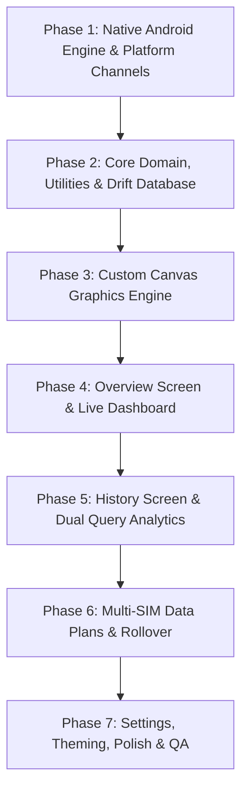
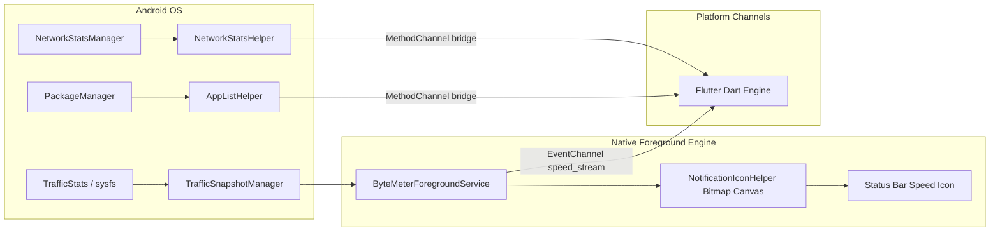
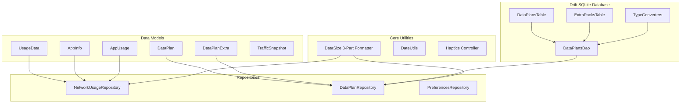
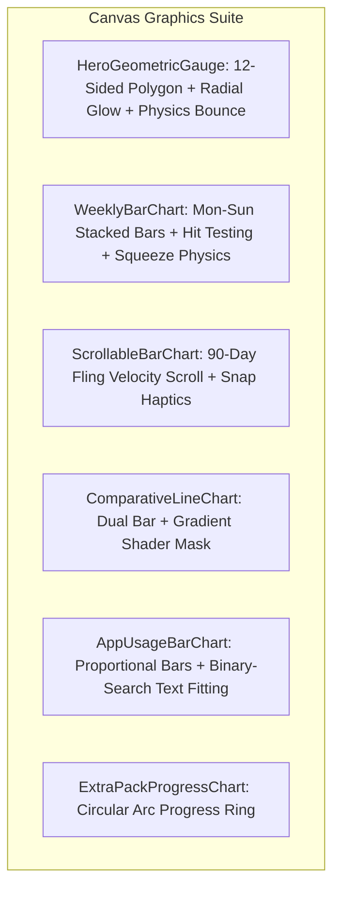
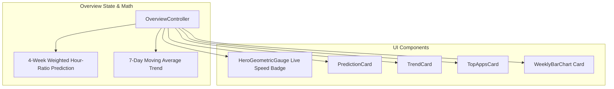
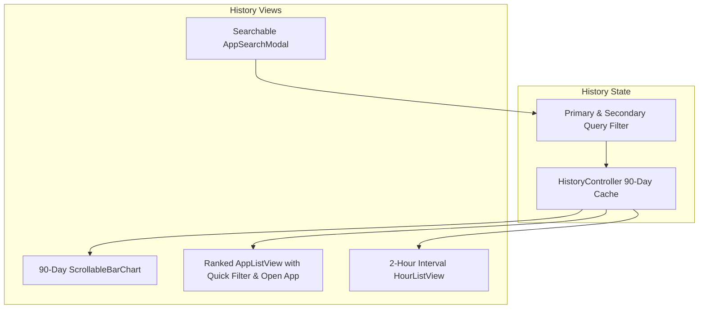
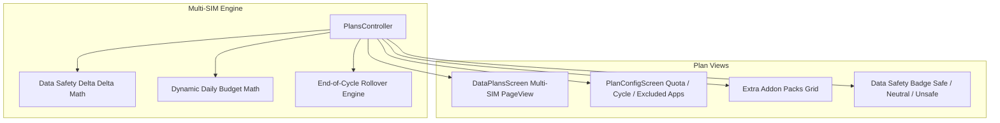
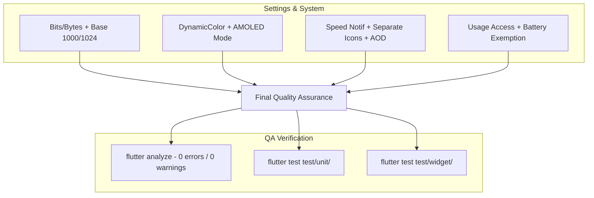

# ByteMeter: Detailed Phase-by-Phase Implementation Plan & Feature Checklists

This document tracks the end-to-end implementation of **ByteMeter** (Flutter rebuild of the open-source Traffic Light network meter). Check off each subtask as it is developed and verified.

---

## 🎯 Verification & Build Protocol

> [!IMPORTANT]
> - **Static Analysis Verification**: Run `flutter analyze` immediately upon completing each phase. A phase is ONLY considered complete when `flutter analyze` returns with **0 issues found**.
> - **Strictly No APK Builds**: NEVER run `flutter build apk` during execution to avoid long compilation times. Rely strictly on `flutter analyze` and fast unit/widget tests (`flutter test`).
> - **Graphify Visuals**: Every phase and data relationship must be documented with Graphify / Mermaid diagrams.

---

## Architecture Flow

---

## Phase 1: Native Android Background Engine & Platform Channels

- [x] **1.1 Android Permissions & Service Manifest Setup**
  - [x] Add `android.permission.ACCESS_NETWORK_STATE`
  - [x] Add `android.permission.FOREGROUND_SERVICE` and `android.permission.FOREGROUND_SERVICE_SPECIAL_USE`
  - [x] Add `android.permission.POST_NOTIFICATIONS`
  - [x] Add `android.permission.RECEIVE_BOOT_COMPLETED`
  - [x] Add `android.permission.REQUEST_IGNORE_BATTERY_OPTIMIZATIONS`
  - [x] Add `android.permission.PACKAGE_USAGE_STATS` (tools:ignore="ProtectedPermissions")
  - [x] Register `ByteMeterForegroundService` with `PROPERTY_SPECIAL_USE_FGS_SUBTYPE`
  - [x] Register `AutoStarter` BroadcastReceiver for `BOOT_COMPLETED`

- [x] **1.2 Hardware Keystore Crypto Engine**
  - [x] Implement `CryptoManager.kt` using Android Keystore `AES/GCM/NoPadding`
  - [x] Implement `HmacSHA256` hashing for subscriber IDs (deterministic database keys)
  - [x] Ensure plain IMSI / Subscriber IDs are never stored in cleartext

- [x] **1.3 Traffic Snapshot & Active Network Interface Monitor**
  - [x] Implement `TrafficSnapshotManager.kt`
  - [x] Register `ConnectivityManager.NetworkCallback` to dynamically track active interfaces (`wlan0`, `rmnet0`)
  - [x] Query `TrafficStats.getTxBytes(interface)` and `TrafficStats.getRxBytes(interface)` on Android 12+ (API 31+)
  - [x] Implement fallback to `/sys/class/net/{interface}/statistics/{tx,rx}_bytes` for older / custom kernels
  - [x] Compute sub-second delta snapshots (`upBytesPerSec`, `downBytesPerSec`, `total`)

- [x] **1.4 Dynamic Status Bar Numeric Icon Canvas Generator**
  - [x] Implement `NotificationIconHelper.kt`
  - [x] Create density-scaled Android `Paint` font formatters
  - [x] Implement `createIcon(speed, unit)` rendering formatted speed digits (`e.g. 2.4 MB`, `150 KB`) directly onto an in-memory `Bitmap`
  - [x] Implement `createIconSeparate(upSpeed, downSpeed)` for dual upload/download speed icons
  - [x] Convert `Bitmap` to `IconCompat` for ongoing notification `smallIcon`

- [x] **1.5 Persistent Foreground Service**
  - [x] Implement `ByteMeterForegroundService.kt` with a 1-second self-calibrating tick loop
  - [x] Create notification channels (`Persistent Notification`, `Silent Notification`, `Warning Notification`)
  - [x] Register `BroadcastReceiver` for `ACTION_SCREEN_ON` and `ACTION_SCREEN_OFF` to pause polling when screen is locked (battery conservation)
  - [x] Implement `AutoStarter.kt` to auto-resume the service after device reboots

- [x] **1.6 Network Statistics & App Info Extractors**
  - [x] Implement `NetworkStatsHelper.kt` querying `NetworkStatsManager`:
    - [x] `querySummary` for per-UID usage buckets
    - [x] `querySummaryForDevice` for aggregate interface traffic
    - [x] Device total delta reconciliation to `UID_OTHER_USERS` (-98)
    - [x] `queryDetailsForUid` for time-series hourly buckets
  - [x] Implement `AppListHelper.kt`:
    - [x] Query `PackageManager.getInstalledApplications`
    - [x] Extract localized app labels
    - [x] Extract app icon drawables and encode to PNG/WebP byte arrays
    - [x] Map special system UIDs (`UID_ALL` = -100, `UID_TETHERING` = -5, `UID_REMOVED` = -4, `UID_OTHER_USERS` = -98, System services < 10000)

- [x] **1.7 Platform Channels Bridge**
  - [x] Implement `ByteMeterPlatformBridge.kt`
  - [x] Register `MethodChannel` (`com.bytemeter/bridge`) for stats queries, app lists, service lifecycle, and permission checks
  - [x] Register `EventChannel` (`com.bytemeter/speed_stream`) for streaming live 1-second speed snapshots to Flutter UI

> [!TIP]
> **Phase 1 Verification Step**: Run `flutter analyze` immediately after Phase 1. Ensure 0 issues found before proceeding.

---

## Phase 2: Core Domain, Utilities & Drift Database

- [x] **2.1 Dependencies & Asset Setup**
  - [x] Add `flutter_riverpod`, `drift`, `sqlite3_flutter_libs`, `path_provider`, `shared_preferences`, `dynamic_color`, `google_fonts`, `intl` to `pubspec.yaml`
  - [x] Configure asset directories (`assets/fonts/`, `assets/icons/`)

- [x] **2.2 High-Precision Data Size Formatter & Utilities**
  - [x] Implement `data_size.dart`:
    - [x] Support Decimal (1000 base: kB, MB, GB, TB) and Binary (1024 base: KiB, MiB, GiB, TiB) metrics
    - [x] Support Bits (kbps, Mbps) vs Bytes (kB/s, MB/s)
    - [x] 3-part structured formatting: `first` (integer part), `second` (decimal part), `third` (unit string)
    - [x] Automatic unit scaling based on magnitude
  - [x] Implement `date_utils.dart` (timestamps, localized hour buckets, relative day strings)
  - [x] Implement `haptics.dart` (context click, long press, toggle tick, segment change)

- [x] **2.3 Domain Data Models**
  - [x] `UsageData`: `upload`, `download`, `total`, `uid`, `start`, `end`
  - [x] `AppInfo`: `uid`, `packageName`, `label`, `iconBytes`, `specialType`
  - [x] `AppUsage`: `AppInfo` + `DayUsage` (primary usage, secondary usage, total)
  - [x] `DataPlan`: Multi-SIM parameters, quota amount, billing start date, monthly/daily cycle, rollover flag, excluded apps list, UI card background/color, custom note
  - [x] `DataPlanExtra`: Addon pack amount, unit, used bytes, start date, expiry date, expired flag
  - [x] `TrafficSnapshot`: `upBytesPerSec`, `downBytesPerSec`, `total`
  - [x] Enums: `DataType` (Mobile, Wifi, None), `DataDirection` (Bidirectional, Download, Upload), `TimeInterval` (Day, Month), `DataSafetyState` (Safe, Neutral, Unsafe)

- [x] **2.4 Drift SQLite Relational Database**
  - [x] Define `DataPlansTable` with primary key `hashedSubscriberId`, encrypted subscriber ID, quota, cycle settings, and JSON-converted excluded apps list
  - [x] Define `ExtraPacksTable` for addon data packs linked to data plans
  - [x] Write TypeConverters for enums and JSON lists
  - [x] Write DAOs with reactive `Stream` and `Future` CRUD methods

- [x] **2.5 Repositories & State Providers**
  - [x] Implement `NetworkUsageRepository` (today usage, week usage, 90-day history, per-app breakdown, hourly buckets)
  - [x] Implement `DataPlanRepository` (save plan, update plan, add extra pack, calculate rollover, compute plan snapshots)
  - [x] Implement `PreferencesRepository` (reactive settings persistence via `SharedPreferences`)

> [!TIP]
> **Phase 2 Verification Step**: Run `flutter analyze` immediately after Phase 2. Ensure 0 issues found before proceeding.

---

## Phase 3: Custom Canvas Graphics Engine

- [x] **3.1 Hero 12-Sided Geometric Gauge Canvas**
  - [x] Implement `hero_geometric_gauge.dart` with `CustomPainter`
  - [x] Draw 12-sided cookie polygon shape with continuous smooth rotation (50s loop)
  - [x] Draw pulsating radial glow gradient matching active network type (Primary container for Cellular, Tertiary container for Wi-Fi)
  - [x] Implement spring physics scale bounce and haptic response on user tap/press

- [x] **3.2 Weekly Mon-Sun Bar Chart**
  - [x] Implement `weekly_bar_chart.dart` with `CustomPainter`
  - [x] Draw dashed background grid lines and horizontal reference baseline
  - [x] Draw stacked rounded bars for Mon-Sun (Cellular vs. Wi-Fi)
  - [x] Implement touch hit-testing for individual bars with squeeze bounce animations and haptic feedback
  - [x] Interactive legend buttons with toggle strength animations

- [x] **3.3 90-Day Fling-Scrollable History Bar Chart**
  - [x] Implement `scrollable_bar_chart.dart`
  - [x] Horizontal scroll gesture with custom `FlingBehavior` and exponential velocity decay
  - [x] Spring snap physics aligning the selected bar with the central selector indicator
  - [x] Animated bar height growth as bars enter the viewport
  - [x] Segment tick haptics when scrolling past consecutive days

- [x] **3.4 Comparative Line Chart with Gradient Text Shader Mask**
  - [x] Implement `comparative_line_chart.dart`
  - [x] Draw dual horizontal proportional bars (Primary query from left, Secondary query from right)
  - [x] Implement `Brush.horizontalGradient` shader mask over text labels to automatically invert text color between filled bar color and empty background

- [x] **3.5 Stacked App Usage Bar Chart**
  - [x] Implement `app_usage_bar_chart.dart`
  - [x] Proportional horizontal bars representing bandwidth consumed by top apps
  - [x] Implement binary-search `TextPainter` measurement to dynamically fit numeric strings (`e.g. 1.24 GB`) within variable-width bar boundaries

- [x] **3.6 Extra Addon Pack Progress Ring**
  - [x] Implement `extra_pack_progress_chart.dart` showing addon pack consumed vs remaining allowance

> [!TIP]
> **Phase 3 Verification Step**: Run `flutter analyze` immediately after Phase 3. Ensure 0 issues found before proceeding.

---

## Phase 4: Overview Screen & Live Speed Dashboard

- [x] **4.1 Predictive & Trend Analytics Engine**
  - [x] Implement `OverviewController` with Riverpod
  - [x] **4-Week Weighted Hour-Ratio Prediction**:
    $$\text{Prediction} = \text{TodayUsage} + \left(\text{Last24hUsage} \times \left(\frac{\sum_{i=1}^4 \text{FullDayUsage}_{t-i\cdot 7d}}{\sum_{i=1}^4 \text{ElapsedDayUsage}_{t-i\cdot 7d}} - 1\right)\right)$$
  - [x] **7-Day Moving Trend Percentage**:
    $$\text{Trend \%} = \left(\frac{\text{HourlyAvg}_{\text{last 24h}}}{\max(\text{HourlyAvg}_{\text{prior 6 days}}, 1.0)} - 1\right) \times 100$$

- [x] **4.2 Overview Screen Layout & Widgets**
  - [x] `HeroGeometricGauge` displaying live formatted Today usage (large integer font + smaller decimal/unit)
  - [x] Segmented pill toggle for Cellular (Mobile) vs. Wi-Fi
  - [x] `PredictionCard`: Predicted total for today with explanation tooltip
  - [x] `TrendCard`: Trend indicator (+X% / -X% badge)
  - [x] `TopAppsCard`: Horizontal proportional bar chart for top 3 apps today
  - [x] `WeeklyBarChart`: Day-by-day weekly breakdown card

- [x] **4.3 Real-Time Speed Stream Integration**
  - [x] Connect native `EventChannel` speed stream to display instantaneous transfer rate badge in dashboard

> [!TIP]
> **Phase 4 Verification Step**: Run `flutter analyze` immediately after Phase 4. Ensure 0 issues found before proceeding.

---

## Phase 5: History Screen & Dual Query Comparison Engine

- [x] **5.1 History Controller & 90-Day Timeline Cache**
  - [x] Implement `HistoryController` caching 90-day daily usage data
  - [x] Manage active date selection, Month vs. Day view, and dual comparison queries

- [x] **5.2 Dual Query Filter Bottom Sheet**
  - [x] Implement `HistoryFilterBottomSheet`
  - [x] Primary Query selector (Data Type: Mobile/Wifi/None, Direction: Both/Down/Up, App: All/Specific)
  - [x] Secondary Query selector for side-by-side comparison
  - [x] Reset Filters and Set as Default buttons

- [x] **5.3 Ranked App List View**
  - [x] Implement `AppListView` with animated list transitions
  - [x] Display app icon, name, and comparative line chart
  - [x] Tap-to-expand card action:
    - [x] **Quick Filter**: Automatically sets this app as the focus filter across the entire 90-day history graph
    - [x] **Open App**: Direct intent launcher to open the selected app

- [x] **5.4 2-Hour Interval Hour List View**
  - [x] Implement `HourListView` breaking down selected day into 2-hour comparative time buckets (00:00-02:00, 02:00-04:00, etc.)

- [x] **5.5 Searchable App Picker Modal**
  - [x] Implement `AppSearchModal`
  - [x] Instant search filtering by app name and package name
  - [x] Priority sorting placing high-bandwidth social and streaming apps at the top (WhatsApp, YouTube, Spotify, Netflix, Instagram, etc.)

> [!TIP]
> **Phase 5 Verification Step**: Run `flutter analyze` immediately after Phase 5. Ensure 0 issues found before proceeding.

---

## Phase 6: Multi-SIM Data Plans, Rollover & Budget Insights

- [x] **6.1 Data Plan Mathematical Logic**
  - [x] Implement `PlansController` with Riverpod
  - [x] **Data Safety Calculation**:
    $$\Delta = \frac{\text{DataUsed}}{\text{TotalQuota}} - \frac{\text{TimeElapsed}}{\text{TotalCycleDuration}}$$
    - $\Delta \le 0.0 \implies \text{Safe (Positive)}$
    - $\Delta \le 0.1 \implies \text{Neutral}$
    - $\Delta > 0.1 \text{ or Usage } > 95\% \implies \text{Unsafe (Negative)}$
  - **Dynamic Remaining Daily Budget**:
    $$\text{DailyBudget} = \frac{\max(\text{TotalQuota} - \text{DataUsed}, 0)}{\text{DaysRemaining} + 1}$$
  - **Today Remaining Daily Budget**: `dailyBudget - todayUsage`
  - **Recurring Rollover**: Unused data at cycle end converts automatically to a temporary `DataPlanExtra` for the next cycle

- [x] **6.2 Multi-SIM Carousel Screen**
  - [x] Implement `DataPlansScreen` with swipeable `PageView` SIM cards
  - [x] SIM card visualization with carrier name, SIM slot badge, custom background gradient/image, and notes
  - [x] Distinguish Configured vs. Unconfigured SIM states

- [x] **6.3 Plan Configuration Screen**
  - [x] Implement `PlanConfigScreen`
  - [x] Quota amount input + unit selector (MB, GB, TB)
  - [x] Billing cycle start date picker
  - [x] Cycle interval (Monthly or custom Day intervals)
  - [x] Rollover toggle switch
  - [x] Excluded zero-rated apps selection sheet

- [x] **6.4 Addon Extra Packs & Insights**
  - [x] Addon pack creation dialog (+X GB valid until date Y)
  - [x] Extra packs progress cards grid
  - [x] `DailyBudgetCard` and `DataSafetyCard` (Safe / Neutral / Unsafe)

> [!TIP]
> **Phase 6 Verification Step**: Run `flutter analyze` immediately after Phase 6. Ensure 0 issues found before proceeding.

---

## Phase 7: Settings, Permissions, Theming, Polish & QA

- [x] **7.1 Unit Formats & Calculation Standards**
  - [x] Bits vs. Bytes toggle switch (e.g. Mbps vs MB/s)
  - [x] Decimal (1000) vs. Binary (1024) toggle switch (e.g. GB vs GiB)
  - [x] Default overview network type preference (Cellular vs. Wi-Fi)

- [x] **7.2 Appearance & Theme Modes**
  - [x] Theme selector: `Auto Material`, `Light Material`, `Dark Material`, `AMOLED Pitch Black`
  - [x] Dynamic Color integration via `dynamic_color`
  - [x] Frosted glass blur toggle (`BackdropFilter`)

- [x] **7.3 Notification Settings Screen**
  - [x] Persistent speed notification master toggle
  - [x] Status bar icon style selector: Single combined speed vs. Separate Up/Down
  - [x] Silent / Auto-hide speed threshold slider (hide icon when speed is below X KB/s)
  - [x] AOD (Always-On-Display) mode toggle (continue or pause updates on screen off)

- [x] **7.4 Permissions Dashboard**
  - [x] Usage Access permission status card with direct system settings intent launcher
  - [x] Battery optimization exemption request card

- [x] **7.5 Automated Testing Suite**
  - [x] Run static analyzer: `flutter analyze` (0 errors / 0 warnings)
  - [x] Unit tests for `DataSize` conversions, predictions, safety ratios, and rollover math (`flutter test test/unit/`)
  - [x] Widget smoke tests for navigation and screen rendering (`flutter test test/widget/`)

- [x] **7.6 Verification Checklist**
  - [x] Live status bar speed meter updates smoothly during downloads on Android
  - [x] Battery efficiency verified: speed polling halts immediately when screen is locked
  - [x] Usage totals match Android Settings Data Usage
  - [x] 90-day history graph scrolls smoothly with snap haptics
  - [x] Zero-rated apps deduct properly from data plan quota

> [!TIP]
> **Phase 7 Verification Step**: Run `flutter analyze` and `flutter test` immediately after Phase 7. Ensure 0 issues found and all tests pass.
