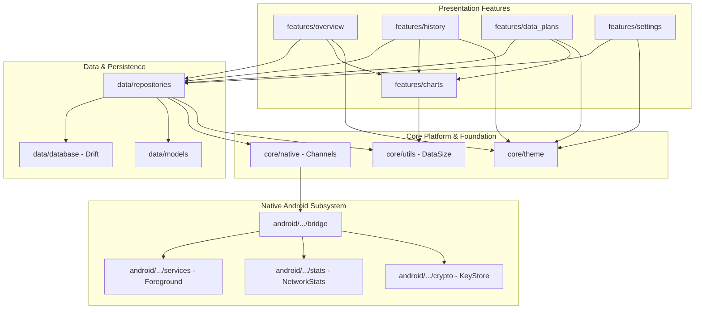

# ByteMeter: Complete Project Tree View

This document provides a comprehensive breakdown of the entire directory and file structure of the **ByteMeter** codebase.

---

## 🎯 Verification & Build Protocol

> [!IMPORTANT]
> - **Static Analysis Verification**: Run `flutter analyze` immediately upon completing each phase. A phase is ONLY considered complete when `flutter analyze` returns with **0 issues found**.
> - **Strictly No APK Builds**: NEVER run `flutter build apk` during execution to avoid long compilation times. Rely strictly on `flutter analyze` and fast unit/widget tests (`flutter test`).
> - **Graphify Visuals**: Architectural structure is mapped with Graphify / Mermaid diagrams.

---

## Component Relationship Map



---

## Directory & File Structure

```
bytemeter/
├── .gitignore                                            # Git ignore configuration
├── analysis_options.yaml                                 # Dart analysis and linter rules
├── pubspec.yaml                                          # Package dependencies and asset declarations
├── README.md                                             # Project overview and build instructions
│
├── docs/                                                 # Modular documentation suite
│   ├── README.md                                         # Documentation index and navigation hub
│   ├── architecture-mvvm.md                              # MVVM & Clean Architecture specification
│   ├── phases.md                                         # Phase-by-phase implementation plan & checklists
│   ├── project-tree-view.md                              # This full directory and file map
│   ├── packages.md                                       # Dependencies and setup specifications
│   ├── design.md                                         # UI/UX design system & architecture blueprint
│   ├── flutter-skills.md                                 # Applied Flutter engineering skills & best practices
│   └── dart-mcp-skills.md                                # Dart & Flutter MCP server integration
│
├── android/                                              # Android native platform implementation
│   ├── build.gradle.kts                                  # Root Gradle build script
│   ├── settings.gradle.kts                               # Gradle plugins & repository setup
│   ├── gradle.properties                                 # JVM args and AndroidX settings
│   └── app/
│       ├── build.gradle.kts                              # App-level build config (JVM 17, minSdk, targetSdk)
│       └── src/main/
│           ├── AndroidManifest.xml                       # Foreground service, boot receiver & permissions
│           ├── kotlin/com/bytemeter/network/bytemeter/
│           │   ├── MainActivity.kt                       # Flutter activity & platform channel binder
│           │   │
│           │   ├── bridge/                               # Platform channel communications
│           │   │   ├── ByteMeterPlatformBridge.kt        # MethodChannel & EventChannel handlers
│           │   │   └── ChannelConstants.kt               # Method names, channel IDs, event stream keys
│           │   │
│           │   ├── services/                             # Native background services & notifications
│           │   │   ├── ByteMeterForegroundService.kt     # Ongoing foreground service (1-second tick loop)
│           │   │   ├── TrafficSnapshotManager.kt         # TrafficStats + active interface listener
│           │   │   ├── NotificationIconHelper.kt         # Dynamic Canvas bitmap speed number renderer
│           │   │   ├── WarningNotificationHelper.kt      # Quota budget overshoot & safety warning notifications
│           │   │   └── AutoStarter.kt                    # RECEIVE_BOOT_COMPLETED broadcast receiver
│           │   │
│           │   ├── stats/                                # Android usage stats engine
│           │   │   ├── NetworkStatsHelper.kt             # NetworkStatsManager query implementation
│           │   │   └── AppListHelper.kt                  # PackageManager app info & icon byte extractor
│           │   │
│           │   └── crypto/                               # Privacy & Security
│           │       └── CryptoManager.kt                  # Hardware KeyStore AES-GCM & HMAC-SHA256
│           │
│           └── res/                                      # Android native resources
│               ├── drawable/
│               │   ├── notification.xml                  # Base notification silhouette icon
│               │   ├── mobiledata_arrows.xml             # Fallback cellular arrows icon
│               │   └── sim_card.xml                      # SIM slot badge icon
│               ├── mipmap-*/                             # App launcher icons
│               └── values/
│                   ├── strings.xml                       # Native Android string resources
│                   └── colors.xml                        # Native colors
│
├── assets/                                               # Flutter bundled assets
│   ├── fonts/                                            # Google Sans / variable typography
│   └── icons/                                            # Vector SVG assets & branding
│
├── lib/                                                  # Flutter Dart Application (MVVM Clean Architecture)
│   ├── main.dart                                         # Bootstrap, ProviderScope & error handlers
│   └── src/
│       ├── app.dart                                      # MaterialApp, DynamicColorBuilder & Theme
│       │
│       ├── core/                                         # Core utilities, constants & theme
│       │   ├── constants/
│       │   │   ├── app_constants.dart                    # Polling intervals, default thresholds
│       │   │   └── special_uids.dart                     # UID_ALL (-100), UID_TETHERING (-5), etc.
│       │   ├── theme/
│       │   │   ├── app_theme.dart                        # Light, Dark, AMOLED & Material You themes
│       │   │   ├── color_schemes.dart                    # Expressive tonal palettes & gradients
│       │   │   └── typography.dart                       # Typographic scales & font weights
│       │   ├── utils/
│       │   │   ├── data_size.dart                        # DataSize converter (Bits/Bytes, Decimal/Binary)
│       │   │   ├── date_utils.dart                       # Timespan, month/day labels, timestamp math
│       │   │   ├── haptics.dart                          # Tactile feedback wrapper
│       │   │   └── size_measurer.dart                    # Canvas text measurement helper
│       │   └── native/
│       │       ├── platform_channel.dart                 # Flutter MethodChannel client wrapper
│       │       ├── native_traffic_bridge.dart            # Native stats API interface
│       │       └── speed_stream_listener.dart            # EventChannel stream for live speed ticks
│       │
│       ├── data/                                         # MODEL LAYER (Entities, DB & Repositories)
│       │   ├── models/
│       │   │   ├── usage_data.dart                       # Upload, download, total, timestamp model
│       │   │   ├── app_info.dart                         # UID, package name, app label, icon bytes
│       │   │   ├── app_usage.dart                        # AppInfo + DayUsage
│       │   │   ├── data_plan.dart                        # SIM Plan, Quota, Dates, Interval, Rollover
│       │   │   ├── data_plan_extra.dart                  # Addon extra pack (amount, expiry)
│       │   │   ├── traffic_snapshot.dart                 # Speed snapshot (up/down per second)
│       │   │   └── enums.dart                            # DataType, DataDirection, TimeInterval
│       │   ├── database/
│       │   │   ├── app_database.dart                     # Drift / SQLite database schema definition
│       │   │   ├── tables/
│       │   │   │   ├── data_plans_table.dart             # DataPlan entity table definition
│       │   │   │   └── extra_packs_table.dart            # Extra addon packs table definition
│       │   │   └── converters/
│       │   │       └── type_converters.dart              # TypeConverters for lists and enums
│       │   └── repositories/
│       │       ├── network_usage_repository.dart         # Query stats from native bridge
│       │       ├── data_plan_repository.dart             # CRUD for SIM Plans, rollover, budget math
│       │       └── preferences_repository.dart           # SharedPreferences wrapper for app settings
│       │
│       ├── features/                                     # VIEW & VIEWMODEL LAYERS (By Feature)
│       │   ├── overview/                                 # Home Dashboard
│       │   │   ├── overview_screen.dart                  # [VIEW] Dashboard layout
│       │   │   ├── overview_controller.dart              # [VIEWMODEL] Prediction & Trend calculations
│       │   │   ├── overview_state.dart                   # [STATE] Immutable overview UI state
│       │   │   └── widgets/
│       │   │       ├── hero_geometric_gauge.dart         # 12-sided rotating cookie Hero canvas
│       │   │       ├── prediction_card.dart              # 4-week hour-ratio predicted daily total
│       │   │       ├── trend_card.dart                   # 7-day moving average trend percentage
│       │   │       └── network_type_toggle_group.dart    # Cellular vs. Wi-Fi pill toggle
│       │   │
│       │   ├── history/                                  # Historical Data Analytics
│       │   │   ├── history_screen.dart                   # [VIEW] 90-day timeline & analytics
│       │   │   ├── history_controller.dart               # [VIEWMODEL] Dual query filter engine
│       │   │   ├── history_state.dart                    # [STATE] Timeline state, selected date, queries
│       │   │   └── widgets/
│       │   │       ├── history_filter_bottom_sheet.dart  # Primary & Secondary query configuration
│       │   │       ├── history_legend_badge.dart         # Dual colored query legend badges
│       │   │       ├── app_list_view.dart                # Ranked App list with comparative bars
│       │   │       ├── hour_list_view.dart               # 2-hour interval time bucket list
│       │   │       ├── app_item_card.dart                # Expandable item (Quick Filter, Open App)
│       │   │       └── app_search_modal.dart             # Search modal with priority streaming apps
│       │   │
│       │   ├── data_plans/                               # Multi-SIM Plans & Quotas
│       │   │   ├── data_plans_screen.dart                # [VIEW] Horizontal SIM card carousel + Insights
│       │   │   ├── plan_config_screen.dart               # [VIEW] Edit plan limit, cycle, rollover, exclusions
│       │   │   ├── plans_controller.dart                 # [VIEWMODEL] Data plan state & budget math
│       │   │   ├── plans_state.dart                      # [STATE] Active SIM plans & snapshots state
│       │   │   └── widgets/
│       │   │       ├── sim_card_pager.dart               # Swipeable multi-SIM card views
│       │   │       ├── data_safety_card.dart             # Safe, Neutral, Unsafe ratio badge
│       │   │       ├── daily_budget_card.dart            # Remaining daily budget & today remaining
│       │   │       ├── extra_packs_grid.dart             # Addon pack progress cards
│       │   │       └── excluded_apps_picker.dart         # Zero-rated apps selection sheet
│       │   │
│       │   ├── settings/                                 # User Settings & Permissions
│       │   │   ├── settings_screen.dart                  # [VIEW] General, Notification, Appearance
│       │   │   ├── notification_settings_screen.dart     # [VIEW] Status bar icon style, AOD, Thresholds
│       │   │   ├── settings_controller.dart              # [VIEWMODEL] Reactive settings state
│       │   │   ├── settings_state.dart                   # [STATE] Settings values state
│       │   │   └── widgets/
│       │   │       ├── permission_status_card.dart       # Usage Access & Battery optimization cards
│       │   │       ├── theme_selector_tile.dart          # Dynamic / Light / Dark / AMOLED picker
│       │   │       └── unit_format_tiles.dart            # Bits/Bytes, 1000/1024 switches
│       │   │
│       │   └── charts/                                   # Custom Painter Visual Canvas Engines
│       │       ├── weekly_bar_chart.dart                 # Interactive Weekly Mon-Sun Bar CustomPainter
│       │       ├── scrollable_bar_chart.dart             # 90-Day Fling-Scrollable Canvas Bar Graph
│       │       ├── comparative_line_chart.dart           # Dual comparative bar with shader text mask
│       │       ├── app_usage_bar_chart.dart              # Proportional stacked bars with text fitting
│       │       └── extra_pack_progress_chart.dart        # Addon pack ring/linear canvas progress
│       │
│       └── widgets/                                      # Reusable UI Components
│           ├── haze_scaffold.dart                        # Frosted glass background blur scaffold
│           ├── mini_card.dart                            # Standardized insight card container
│           ├── custom_button_group.dart                  # Material Expressive segmented buttons
│           └── live_speed_badge.dart                     # Real-time transfer rate badge
│
└── test/                                                 # Automated Test Suite
    ├── unit/
    │   ├── data_size_test.dart                           # Conversions & formatting tests
    │   ├── analytics_math_test.dart                      # Prediction & Trend algorithm tests
    │   ├── plan_budget_test.dart                         # Rollover, safety ratio, budget tests
    │   └── uid_reconciliation_test.dart                  # Special UIDs & device delta test
    └── widget/
        ├── overview_screen_test.dart
        ├── history_screen_test.dart
        └── data_plans_screen_test.dart
```
